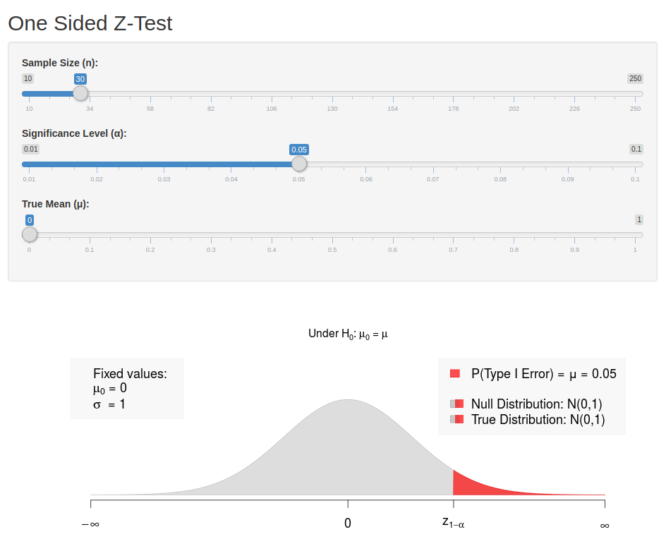

# Statistical Hypothesis Testing


## Hypotheses and Test-Statistics


Assume an independently and identically distributed random sample $X_1,\dots,X_n$, where the distributions of $X_1,\dots,X_n$ depend on some unknown parameter $\theta\in \Omega$, where $\Omega$ is some parameter space.

\


**General Testing problem:** 

$$H_0:\theta\in \Omega_0$$
against
$$H_1:\theta\in \Omega_1$$

$H_0$ is the null hypothesis, while $H_1$ is the alternative. $\Omega_0\subset \Omega$ and $\Omega_1\subset \Omega$ are used to denote the possible values of $\theta$ under $H_0$ and $H_1$, respectively. Necessarily, $\Omega_0\cap \Omega_1=\emptyset$.

For a large number of tests we have $\Omega=\mathbb{R}$ and the respective null hypothesis states that $\theta$ has a specific value $\theta_0\in\mathbb{R}$, i.e., $\Omega_0=\{\theta_0\}$ and $H_0:\theta=\theta_0$. Depending on
the alternative one then often distinguishes between one-sided ($\Omega_1=(\theta_0,\infty)$ or
$\Omega_1=(-\infty,\theta_0)$) and two-sided tests ($\Omega_1=\{\theta\in\mathbb{R}| \theta\neq \theta_0\}$).

\


The data $X_1,\dots,X_n$ is used in order to decide whether to accept or to reject $H_0$.


\

**Test Statistic:** 
Every  hypothesis test relies on a corresponding test statistic
$$T=T(X_1,\dots,X_n).$$ 
Any test statistics is a real valued random variable, and for given
observations the resulting observed value $T_{obs}$ is used to decide between
$H_0$ and $H_1$. Generally, the distribution of $T$ under $H_0$ is analyzed in order
to define a **rejection region**  $C$:

- $T_{obs}\not\in C$ $\Rightarrow$ $H_0$ is not rejected
- $T_{obs}\in C$ $\Rightarrow$ $H_0$ is rejected

Typically  $C$ is of the form  $(-\infty,c_0]$, $[c_1,\infty)$ or 
$(-\infty,c_0]\cup [c_1,\infty)$. The limits of the respective intervals are
called **critical values**, and are obtained from quantiles of the **null distribution**, 
i.e., the distribution of $T$ under $H_0$.


\


Decision Errors      Verbal Definition                              Formal Definition 
------------------  -------------------------------------------  ----------------------
Type I error         $H_0$ is rejected even though $H_0$ is true.   $P(T\not\in C|\,H_0\text{ true})$  
Type II error        The test fails to reject a false $H_0$.        $P(T\in C    |\,H_1\text{ true})$  


## Significance Level, Size and P-values


In a statistical significance test, the probability of a type I error is controlled by the **significance level** $\alpha$ (e.g., $\alpha=5\%$).

$$P\left(\text{Type I error}\right)=P\left(T\in C| \ H_0\text{ true}\right)\leq \alpha$$

The **size** of a statistical test is defined as
$$\sup_{\theta\in\Omega_0} P(T\in C|\theta\in\Omega_0).$$

The preselected significance level $\alpha$ is a bound for the size, which may not be attained (i.e., size $<\alpha$) if, for instance, the relevant probability function is discrete.


\


Practically important significance levels:

- $\alpha=0.05$ - It is common to say that a test result is "significant" if a hypothesis test of level $\alpha=0.05$ rejects $H_0$.
- $\alpha=0.01$ - It is common to say that a test result is "strongly significant" if a hypothesis test of level $\alpha=0.01$ rejects $H_0$.


<!-- {\bf P-value:} Statistical software usually determines the p-value of a test.\\ -->

**p-value:** The p-value is the probability of obtaining a test statistic at least as extreme as the one that was actually observed, assuming that the null hypothesis is true.

\

**Remarks:**

- The p-value is random since it depends on the observed data. That is, different random samples will lead to different p-values.
- For given data, having determined the p-value of a test we also know the test
decisions for all possible levels $\alpha$:
\begin{align*}
\alpha > \text{p-value} & \Rightarrow H_0 \text{ is rejected }\\
\alpha < \text{p-value} & \Rightarrow H_0 \text{ is accepted }
\end{align*}


\


```{r pvalueFig, echo=FALSE, fig.cap="From: https://xkcd.com/1478/", fig.align = 'center'}
knitr::include_graphics("img/xkcd_p_values.png")
```


**Example:**
Let $X_i\sim N(\mu,\sigma^2)$ independently for all $i=1,\dots,5=n$. Observed realizations from this iid random sample:

$X_1=19.20$, $X_2=17.40$, $X_3=18.50$, $X_4=16.50$, $X_5=18.90$

$$\Rightarrow \bar X =18.1$$

\

Testing problem: $H_0:\mu=17$ against $H_1:\mu\ne 17$ (two-sided test).

\

Since the variance is unknown, we have to use a **t-test** in order to test $H_0$. Test statistic of the t-test:
$$T=\frac{\sqrt{n}(\bar X-\mu_0)}{S},$$
where $S^2=\frac{1}{n-1} \sum_{i=1}^n (X_i-\bar X)^2$ is the unbiased estimator of $\sigma^2$.
$$T_{obs}=\frac{\sqrt{5}(18.1-17)}{1.125}=2.187$$
$$\Rightarrow \hbox{p-value}=P( |T_{n-1}|\ge 2.187)=0.094$$

\

t-test for different significance levels  $\alpha$:

- $\alpha=0.2\phantom{0}$ $\Rightarrow$ $2.187>t_{4,0.9}\;=1.533$ $\Rightarrow$ $H_0$ is rejected
- $\alpha=0.1\phantom{0}$ $\Rightarrow$ $2.187>t_{4,0.95}=2.132$ $\Rightarrow$ $H_0$ is rejected
<!-- - $\alpha=0.094=\hbox{p-value}$ $\Rightarrow$ $2.187=t_{4,0.953}=2.187$$\qquad\qquad\Rightarrow$ $H_0$ is rejected -->
- $\alpha=0.05$ $\Rightarrow$ $2.187<t_{4,0.975}=2.776$ $\Rightarrow$ $H_0$ is accepted
- $\alpha=0.01$ $\Rightarrow$ $2.187<t_{4,0.995}=4.604$ $\Rightarrow$ $H_0$ is accepted


## The power function


For every possible value $\theta\in \Omega_0\cup \Omega_1$, all sample
sizes $n$ and each significance level $\alpha$ the corresponding value of
the **power function** $\beta$ is given by the probability
$$
\beta_{n,\alpha}(\theta):=P(H_0 \text{ is rejected, if the true parameter value equals }\theta)
$$

Obviously, $\beta_{n,\alpha}(\theta)\leq \alpha$ for all $\theta\in\Omega_0$. For any $\theta\in\Omega_1$,
 $1-\beta_{n,\alpha}(\theta)$ is the probability of committing a type II error.

The power function is an important tool for accessing the quality of a test and for comparing different test procedures. Obviously, the power of a test depends on the true value $\theta\in\Omega$, the sample size $n$, and on the significance level $\alpha$.

\

Some important terminology:
- If possible, a test is constructed in such a way that size equals level, i.e.,
$\beta_{n,\alpha}(\theta)=\alpha$ for some $\theta\in\Omega_0$. In some cases, however, as for discrete test statistics or complex, composite null hypothesis, it is not possible to reach the level, and
$\sup_{\theta\in\Omega_0}\beta_{n,\alpha}(\theta)<\alpha$. In this case the test is called **conservative**.
- **Unbiased test:** A significance test of level $\alpha>0$ is called  **unbiased** if $\beta_{n,\alpha}(\theta)\ge\alpha$ for all $\theta\in\Omega_1$.
- **Consistent Test:** A significance test of level $\alpha>0$ is called  **consistent** if
$$\lim_{n\rightarrow \infty} \beta_{n,\alpha}(\theta) =1$$
for all $\theta\in \Omega_1$.

\


When choosing between different testing procedures for the same testing problem, one will usually prefer
the **most powerful** test. Consider a fixed sample size $n$.

- For a specified $\theta\in\Omega_1$, a test with power function $\beta_{n,\alpha}(\theta)$ is said to be **most powerful** for $\theta$ if for any alternative test with power function $\beta^*_{n,\alpha}(\theta)$,
$$\beta_{n,\alpha}(\theta)\ge \beta^*_{n,\alpha}(\theta)$$
holds for all levels $\alpha>0$.
- A test with power function $\beta_{n,\alpha}(\theta)$ is said to be **uniformly most powerful** against the set of alternatives $\Omega_1$ if for any alternative test with power function $\beta^*_{n,\alpha}(\theta)$,
$$\beta_{n,\alpha}(\theta)\ge \beta^*_{n,\alpha}(\theta)\quad \text{holds for all }\theta\in\Omega_1, \alpha>0$$

Unfortunately, uniformly most powerful tests only exist for very special testing problems.


\


**Example:** Let $X_1,\dots,X_n$ be an iid random sample. Assume that $n=9$, and
that $X_i\sim N(\mu,0.18^2)$. Hence, in this simple example only the mean $\mu=E(X)$ is unknown, while
the standard deviation has the known value $\sigma=0.18$.

Testing problem: $H_0:\mu=\mu_0$ against $H_1:\mu\neq \mu_0$ for $\mu_0=18.3$.

Since the variance is known, a test may rely on the Gauss test statistic
$$Z=\frac{\sqrt{n} (\bar X -\mu_0)}{\sigma} =\frac{3 (\bar X -18.3)}{0.18}$$

Under $H_0$ we have $Z\sim N(0,1)$, and for the significance level $\alpha=0.05$ the null hypothesis is rejected if
$$|Z|\geq z_{1-\alpha/2}=1.96.$$
Here $z_{1-\alpha/2}$ denotes the corresponding quantile of the standard normal distribution. Note that the size of this test equals its level $\alpha=0.05$.

For determining the rejection region of a test it suffices to determine the distribution of the test statistic under $H_0$. But in order to calculate the power function one needs to quantify the distribution of the test statistic for all possible values $\theta\in\Omega$. For many important problems this is a formidable task. In our example it is, however, quite easy. Note that for any (true) $\mu\in\mathbb{R}$ the corresponding distribution of $Z\equiv Z_\mu=\sqrt{n(\bar X-\mu_0)}/\sigma$ is
$$Z_\mu=\frac{\sqrt{n} (\mu -\mu_0)}{\sigma}+\frac{\sqrt{n} (\bar X -\mu)}{\sigma}
\sim N\left(\frac{\sqrt{n} (\mu -\mu_0)}{\sigma}, 1\right)$$
This implies that with $\Phi$ denoting the distribution function of the standard normal distribution we obtain
\begin{align*}
\beta_{n,\alpha}(\mu)
& = P\left(|Z_\mu|>z_{1-\alpha/2}\right)\\
& = 1-\Phi\left(z_{1-\alpha/2}-\frac{\sqrt{n} (\mu -\mu_0)}{\sigma}\right) + \Phi\left(-z_{1-\alpha/2}-\frac{\sqrt{n} (\mu -\mu_0)}{\sigma}\right)
\end{align*}


The example values $\mu_0=18.3$, $n=9$ and $\sigma=0.18$ lead to:

- $\mu=18.36$ and $\alpha=0.05$ $\Rightarrow$ $\beta_{9,0.05}(18.36)=0.168$
- $\mu=18.48$ and $\alpha=0.05$ $\Rightarrow$ $\beta_{9,0.05}(18.48)=0.873$
- $\mu=18.48$ and $\alpha=0.01$ $\Rightarrow$ $\beta_{9,0.05}(18.48)=0.663$


This example illustrates the power function of a "good" test, since:

- Under $H_0:\mu=\mu_0$ we have $\beta_{n,\alpha}(\mu_0)=\alpha$.
- The test is unbiased, since $\beta_{n,\alpha}(\mu)\geq\alpha$ for any $\mu\neq \mu_0$.
- The test is consistent, since $\lim_{n\rightarrow\infty} \beta_{n,\alpha}(\mu)=1$ for every fixed $\mu\neq \mu_0$.


\

For fixed sample size $n$, $\beta_{n,\alpha}(\mu)$ increases as the distance $|\mu-\mu_0|$ increases.
If $|\mu-\mu_0|>|\mu^*-\mu_0|$ then $\beta_{n,\alpha}(\mu)>\beta_{n,\alpha}(\mu^*)$. On the other hand,
$\beta_{n,\alpha}(\mu)$ decreases as the size $\alpha$ of the test decreases. If $\alpha>\alpha^*$ then
$\beta_{n,\alpha}(\mu)>\beta_{n,\alpha^*}(\mu)$.


Assuming that the basic assumptions (normality and known variance) are true, the above "Gauss-test" is even the most prominent example of a uniformly most powerful test. Under these conditions, for any possible value of $\mu$ no other possible test can achieve a larger value of $\beta_{n,\alpha}(\mu)$.


## Asymptotic Null Distributions


Generally, the underlying distributions are unknown. In this case it is usually not possible to compute the power function of a test for fixed $n$ (exceptions are so called "distribution-free" tests in nonparametric statistics). The only way out of this difficulty is to rely on large sample asymptotics and corresponding asymptotic distributions, which allow to approximate the power function and to study the **asymptotic efficiency** of a test. The finite sample behavior of a test for different sample sizes $n$ is then evaluated by **simulation studies**.


For a real-valued parameter $\theta$ most tests of $H_0:\theta=\theta_0$ rely on estimators $\hat\theta$ of $\theta$. Under suitable regularity conditions on the underlying distribution central limit theorems usually imply that as $n\rightarrow\infty$
$$\sqrt{n}(\hat\theta - \theta)\rightarrow_D N(0,v^2),$$
where $v^2$ is the asymptotic variance of the estimator. % Often a consistent estimator $\hat v^2$ of $v^2$ can be determined from the data. For large $n$ we then approximately have
$$\frac{\sqrt{n}(\hat\theta - \theta)}{ v}\sim N(0,1).$$
For given $\alpha$, a one-sided test  of $H_0:\theta=\theta_0$ against $H_1:\theta>\theta_0$ then rejects $H_0$ if
$$
Z=\frac{\sqrt{n} (\hat\theta -\theta_0)}{v}>z_{1-\alpha}.
$$
The corresponding asymptotic approximation (valid for sufficiently large $n$) of the true power function is then given by
$$
\beta_{n,\alpha}(\theta) = 1-\Phi\left(z_{1-\alpha}-\frac{\sqrt{n} (\theta -\theta_0)}{v}\right)
$$

\

Note that in practice the (unknown) true value $v^2$ is generally replaced by an estimator $\hat v^2$ determined from the data. As long as $\hat v^2$ is a consistent estimator of $v^2$ this leads to the same asymptotic power function. The resulting test is asymptotically unbiased and consistent.

\

Usually there are many different possible estimators. Consider an alternative estimator $\tilde\theta$ of $\theta$ satisfying
$$
\sqrt{n}(\tilde\theta - \theta)\rightarrow_D N(0,\tilde v^2).
$$
If the asymptotic variance $v^2$ of the estimator $\hat\theta$ is smaller than the asymptotic variance $\tilde v^2$ of $\tilde\theta$, i.e., $v^2<\tilde v^2$, then $\hat\theta$ is a **more efficient** estimator of $\theta$. Then necessarily the test based on $\hat\theta$ is **more powerful** than the test based on $\tilde\theta$, since asymptotically for all $\theta>\theta_0$
<!-- \begin{align*} -->
<!-- \tilde\beta_{n,\alpha}(\theta) &= 1-\Phi\left(z_{1-\alpha}-\frac{\sqrt{n} (\theta -\theta_0)}{\tilde v}\right)\\ -->
<!-- & < 1-\Phi\left(z_{1-\alpha}-\frac{\sqrt{n} (\theta -\theta_0)}{v}\right)=\beta_{n,\alpha}(\theta) -->
<!-- \end{align*} -->


\

**Example:** Let $X_1,\dots,X_n$ be an iid random sample. Consider testing $H_0:\mu=\mu_0$ against $H_1:\mu>\mu_0$, where $\mu:=E(X_i)$. For a given level $\alpha$ the t-test then rejects $H_0$ if
$$
T=\frac{\sqrt{n}(\bar X-\mu_0)}{S}>t_{n-1;1-\alpha},
$$
where $t_{n-1;1-\alpha}$ is the $1-\alpha$ quantile of a t-distributions with $n-1$-degrees of freedom. This is an exact test if the distribution of $X_i$ is normal. In the general case, the justification of the t-test is based on asymptotic arguments. Under some regularity conditions the central limit theorem implies that
$$
\sqrt{n}(\bar X - \mu)\rightarrow_D N(0,\sigma^2)
$$
with $\sigma^2=Var(X_i)$. Moreover, $S^2$ is a consistent estimator of $\sigma^2$ and $t_{n-1;1-\alpha}\rightarrow z_{1-\alpha}$ as $n\rightarrow \infty$. Thus even if the distribution of $X_i$ is non-normal, for sufficiently large $n$, $T=\frac{\sqrt{n}(\bar X-\mu_0)}{S}$ is approximately $N(0,1)$-distributed and the asymptotic power function of the t-test is given by
$$
\beta_{n,\alpha}(\theta) = 1-\Phi\left(z_{1-\alpha}-\frac{\sqrt{n} (\mu -\mu_0)}{\sigma}\right)
$$


## Multiple comparisons

In statistics, the multiple comparisons, multiplicity or multiple testing problem occurs when one considers a set of statistical inferences simultaneously or infers a subset of parameters selected based on the observed values. Errors in inference, including confidence intervals that fail to include their corresponding population parameters or hypothesis tests that incorrectly reject the null hypothesis are more likely to occur when one considers the set as a whole.

<!-- This is an important, although largely ignored problem in applied econometric work.  -->

In empirical studies often dozens or even hundreds of tests are performed for the same data set. When **searching** for
significant test results, one may come up with **false discoveries**.

<!-- Multiple tests: In some study many different tests are done simultaneously -->

**Example:** $m$ different, independent test of significance level $\alpha>0$. (Independence means that the test statistics used are mutually independent -- this is usually not true in practice). Let's assume that a common null hypothesis $H_0$ holds for each of the $m$ tests. Then

$$
P \begin{pmatrix}
      \text{Type I error}\\
      \text{by at least} \\
      \text{one of the $m$ tests}
  \end{pmatrix}
= 1 - (1 - \alpha)^m =: \alpha_m>\alpha
$$


Therefore, as $m$ increases also the probability of a type I error increases:

$m$       $\alpha_m$
-------  ---------
1        0.05
3        0.143
5        0.226
10       0.401
100      0.994 (!)


\


**Analogous problem:** Construction of $m$ many $(1-\alpha)$-confidence intervals.
$$
P \begin{pmatrix}
      \text{at least one of the $m$ confidence} \\
      \text{intervals does not contain} \\
      \text{the true parameter value} \end{pmatrix}
    = 1 - (1-\alpha)^m>\alpha
$$


\


This represents the general problem of multiple comparisons. In practice, it will not be true that all test statistics used are mutually independent. (This even complicates the problem.) However, we will still have the effect that the probability of at least one falsely significant result increases with the number $m$ of tests, but it will not be equal to $1 - (1-\alpha)^m$.

\

A statistically rigorous **solution** of this problem consists in modifying the constructions of tests or confidence intervals in order to arrive at **simultaneous tests**:
$$
P \begin{pmatrix}
  \text{Type I error by} \\
  \text{at least one of the $m$ tests}
  \end{pmatrix} \le \alpha
$$
or **simultaneous confidence intervals**:
\begin{align*}
&P \begin{pmatrix}
      \text{at least one of the $m$ confidence} \\
      \text{intervals does not contain} \\
      \text{the true parameter value}
  \end{pmatrix}  \le \alpha\\[2ex]
\Leftrightarrow
&P \begin{pmatrix}
    \text{All confidence intervals} \\
    \text{simultaneously contain the} \\
    \text{true parameter values}
  \end{pmatrix} \geq 1 - \alpha
\end{align*}


\

For certain problems (e.g., analysis of variance) there exist specific procedures for constructing
simultaneous confidence intervals. However, the only generally applicable procedure seems to be the Bonferroni
correction. It is based on Boole's inequality.


**Theorem (Boole):** Let $A_1, A_2, \dots, A_m$ denote $m$ different events. Then
$$
 P(A_1 \cup A_2 \cup \dots \cup A_m) \leq
  \sum_{i=1}^m P(A_i).
$$
This inequality also implies that:
$$
 P(A_1 \cap A_2 \cap \dots \cap A_m) \ge
  1 - \sum_{i=1}^m P(\bar A_i),
$$
where $\bar A_i$ denotes the complementary event "not $A_i$".


\

**Example: Bonferroni adjustment** for $m$ different tests of level $\alpha^* = \alpha/m$.
$$
P\begin{pmatrix}
\text{Type I error by} \\
\text{at least one of the $m$ tests}
\end{pmatrix}
\leq \sum_{i=1}^m \alpha^\ast = \alpha
$$


<!-- \item Analogously: Construction of $m$ many $(1-\alpha^*)$-confidence intervals, -->
<!-- $\alpha^* =\frac{\alpha}{m}$: -->
<!--   \begin{equation*} -->
<!--     \Rightarrow -->
<!--     P\begin{pmatrix} -->
<!--       \text{at least one of the $m$ confidence} \\ -->
<!--       \text{intervals does not contain} \\ -->
<!--       \text{the true parameter value} \end{pmatrix} -->
<!--        \le \sum_{i=1}^m \alpha^\ast = \alpha -->
<!--     \end{equation*}    -->
<!--     %%%%%%%%%%%% -->
<!--     \begin{equation*} -->
<!--     \Leftrightarrow -->
<!--     P\begin{pmatrix} -->
<!--     \text{all confidence interval} \\ -->
<!--     \text{simultaneously contain the} \\ -->
<!--     \text{true parameter values}\end{pmatrix} -->
<!--     \ge 1 - \sum_{i=1}^m \alpha^\ast = 1 - \alpha -->
<!--   \end{equation*} -->
<!-- \end{itemize} -->

<!-- \newpage -->

<!-- {\bf Example: Regression analysis} -->
<!-- For $n=40$ US corporations a multiple regression model is used to model the observed return of capital $Y$ -->
<!-- in dependence of 12 explanatory variables. After eliminating two outliers, the following table provides -->
<!-- the results of the regression analysis. -->


<!-- {\small -->
<!-- \begin{verbatim} -->
<!--         Coefficients: -->
<!--                 Estimate Std. Error t value Pr(>|t|) -->
<!--     (Intercept)  0.24883    0.14386   1.730  0.09603 . -->
<!--     WCFTCL       1.11519    0.36955   3.018  0.00579 ** -->
<!--     WCFTDT      -0.21457    0.39528  -0.543  0.59206 -->
<!--     GEARRAT     -0.01992    0.10610  -0.188  0.85261 -->
<!--     LOGSALE      0.49969    0.18335   2.725  0.01156 * -->
<!--     LOGASST     -0.48743    0.17500  -2.785  0.01005 * -->
<!--     NFATAST     -0.30425    0.15446  -1.970  0.06003 . -->
<!--     CAPINT      -0.08022    0.03706  -2.165  0.04017 * -->
<!--     FATTOT      -0.11086    0.09125  -1.215  0.23571 -->
<!--     INVTAST      0.23047    0.23588   0.977  0.33790 -->
<!--     PAYOUT       0.00168    0.01717   0.098  0.92284 -->
<!--     QUIKRAT      0.08012    0.10827   0.740  0.46617 -->
<!--     CURRAT      -0.18976    0.09244  -2.053  0.05070 . -->
<!--     --- -->
<!-- Signif. codes: 0 `***' 0.001 `**' 0.01 `*' 0.05 `.' 0.1 ` ' 1 -->

<!--     Residual standard error: 0.0552  -->
<!--     Multiple R-Squared: 0.6958,     -->
<!--     Adjusted R-squared: 0.5498 -->
<!--     F-statistic: 4.765 on 12 and 25 DF,  -->
<!--     p-value: 0.0004878 -->
<!-- \end{verbatim}} -->


# R-Lab: The Gauss-Test


Let's reconsider the simplest test statistic you will ever meet: The **Gauss-Test** (Or "Z-Test").


**Setup:** Let $X_1,\dots,X_n$ be an iid random sample with $X_i\sim N(\mu,\sigma^2)$ and $\sigma^2<\infty.$

**Idea:** Under the above setup, $\bar{X}_n=n^{-1}\sum_{i=1}^n X_i$ consistently estimates the (unknown) true mean value $\mu$. That is, $\bar{X}_n\to_p\mu$.

*  Under the null hypothesis (i.e., $\mu_{0}=\mu$), the difference  $\bar{X}_n-\mu_{0}$ should be "small".
*  Under the alternative hypothesis (i.e., $\mu_{0}\neq\mu$), the difference  $\bar{X}_n-\mu_{0}$ should be "large".


\

Under the null hypothesis $H_0$ we have that $\mu_{0}=\mu$. Therefore:
$$
Z=\frac{\sqrt{n}\,(\bar{X}_n-\mu_{0})}{\sigma}=\underbrace{\frac{\sqrt{n}\,(\bar{X}_n-\mu)}{\sigma}}_{\sim N(0,1)}
$$

\

Under the alternative $H_1$ we have that $\;\mu_{0}\neq \mu$. Therefore:
\begin{align*}
Z&=\frac{\sqrt{n}\,(\bar{X}_n-\mu_{0})}{\sigma}\\
&=\frac{\sqrt{n}\,(\bar{X}_n-\mu_{0}+\mu-\mu)}{\sigma}\\
&=\frac{\sqrt{n}\,(\bar{X}_n-\mu)}{\sigma}+{\color{blue}{ \frac{\sqrt{n}\,(\mu-\mu_{0})}{\sigma} }} \sim N\left({\color{blue}{\frac{\sqrt{n}\,(\mu-\mu_{0})}{\sigma}}},1\right)
\end{align*}

The different distributions (under $H_0$ and $H_1$) of the test statistic $Z$ can be investigated in the following dynamic plot:
```{r, echo=FALSE}
if(!knitr:::is_latex_output()){
  knitr::include_app("https://dliebl.shinyapps.io/Gauss-Test-Distr/",
  height = "1200px")
}
```

```{r, echo=FALSE, fig.cap="See: https://dliebl.shinyapps.io/Gauss-Test-Distr/", fig.align = 'center'}
if(knitr:::is_latex_output()){

}
```


