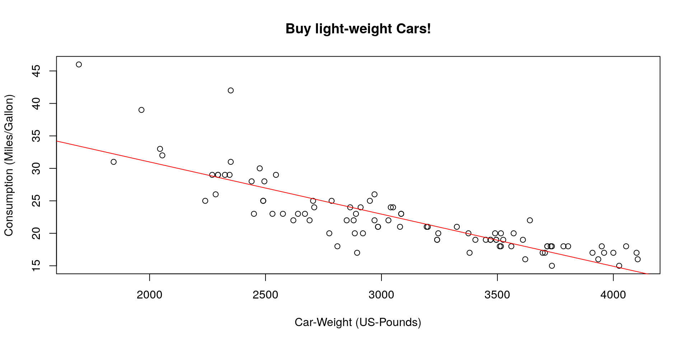
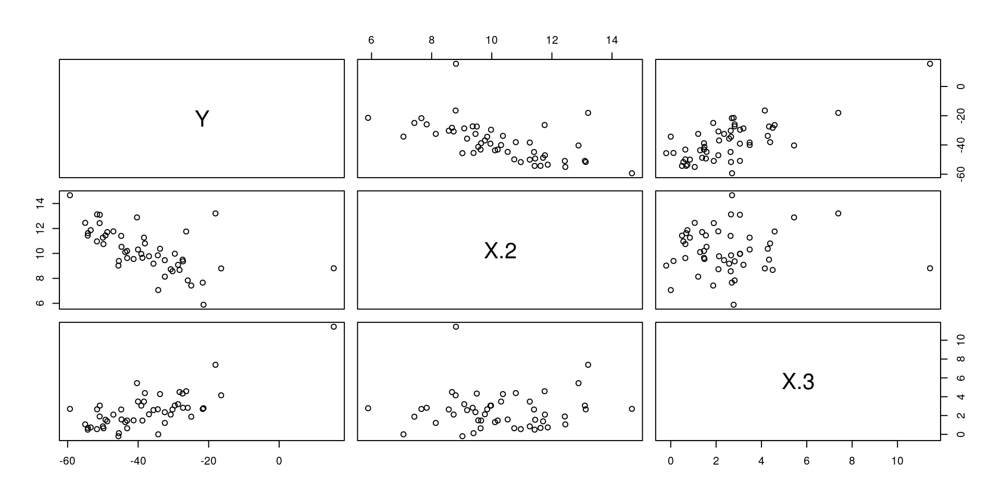
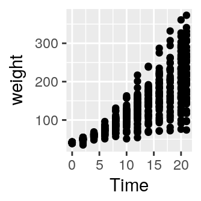
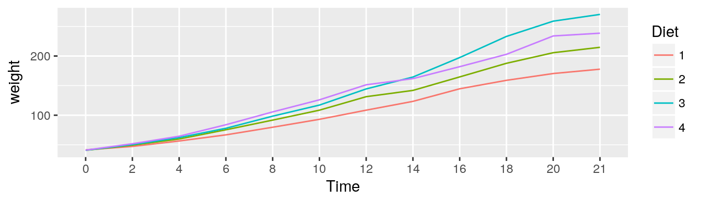
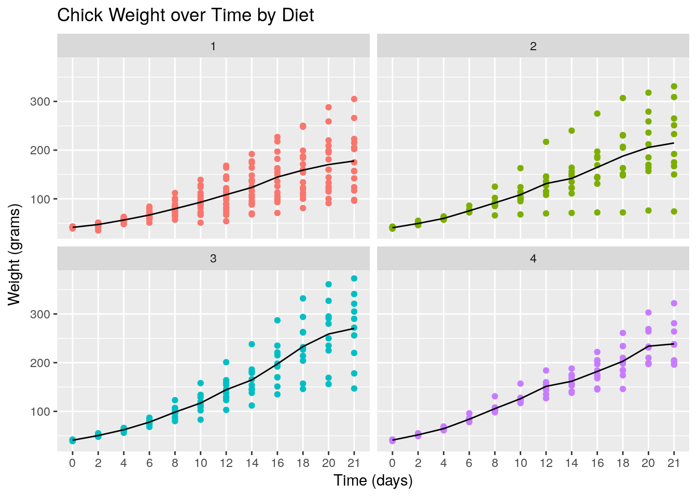

--- 
title: "Project Module in Econometrics & Statistics"
author: "JProf. Dominik Liebl"
date: "2018-09-28"
site: bookdown::bookdown_site
documentclass: book
bibliography: [book.bib]
biblio-style: apalike
link-citations: yes
github-repo: lidom/PM_ES_Script
url: 'http\://dliebl.com/PM_ES_Script/'
description: "Script for the project module in econometrics & statistics."
---

# Preface {-}

This is the script for the project module in econometrics & statistics.


**General Topic:**
Regression analysis and beyond 
  
**Description:** 
This project module covers modern methods in statistics and econometrics with a focus on regression analysis. Participants have the opportunity to choose among a set of specific projects. Topics suggested by the participants are generally appreciated, but will be assessed with respect to their practical feasibility. All projects should have a theoretical part describing the model and the estimation procedures, a Monte-Carlo simulation study, and an application to real data. Depending on the actual number of participants, it might be that the project work has to be carried out as a group task rather than as an individual task. The first five to six weeks consist of lectures (4h per week). Participation is strongly recommended and active participation is desirable. After the lecture series, the groups will have regular meetings with the supervisor. 

**Grading:**
Each student will be evaluated on the basis of a presentation (Scheduled for begin/mid of January) and a seminar paper (Deadline: end of February). 


<!--chapter:end:index.Rmd-->

# Introduction to R


This tutorial aims to serve as an introduction to the software package R. Other very good and much more exhaustive tutorials and useful reference-cards can be found at the following links: 

*  [Reference card for R commands](http://cran.r-project.org/doc/contrib/refcard.pdf) (always useful)
*  [Matlab/R reference card](http://www.math.umaine.edu/~hiebeler/comp/matlabR.pdf) (for those who are more familiar with Matlab)
*  [The official Introduction to R](https://cran.r-project.org/doc/manuals/r-release/R-intro.pdf) (very detailed)
*  And many more at [www.r-project.org](https://www.r-project.org/other-docs.html) (see "Documents")
*  An interactive introduction can be done online at: [www.datacamp.com](https://www.datacamp.com/)
*  An excellent book project which covers also advanced issues such as "writing performant code" and "package development": [adv-r.had.co.nz](http://adv-r.had.co.nz/)  


Why R? 

*  R is **free** of charge from: [www.r-project.org](https://www.r-project.org/)
*  The celebrated IDE **RStudio** for R is also **free** of charge: [www.rstudio.com](http://www.rstudio.com/)
*  R is equipped with one of the most flexible and powerful graphics routines available anywhere. \
   For instance, check out this repository on [Clean Graphs](http://shinyapps.org/apps/RGraphCompendium/index.php) or this: [R graph catalog](http://shiny.stat.ubc.ca/r-graph-catalog/).
*  The S language (R is a dialect of S) is the de-facto standard for statistical science.
   Reading the statistical literature, you will find that examples and even pseudo-code are often written in R-compatible syntax. 


## Short Glossary

Lets start the tutorial with a (very) short glossary:

* **Console**: The thing with the "**>**" sign at the beginning.
* **Script file**: An ordinary text file with suffix "**.R**". For instance, **yourFavoritFileName.R**.
* **Working directory**: The file-directory you are working in. Useful commands: with `getwd()` you get the location of your current working directory and `setwd()` allows you to set a new location for it. 
* **Workspace**: This is a hidden file (stored in the working directory), where all objects you use (e.g., data, matrices, vectors, variables, functions, etc.) are stored. Useful commands: `ls()` shows all elements in our current workspace and `rm(list=ls())` deletes all elements in our current workspace.


## First Steps


A good idea is to use a script file such as **yourFavoritFileName.R** in order to store your R commands. You can send single lines or marked regions of your R-code to the console by pressing the keys **STRG+ENTER**.


To begin with baby steps, do some simple computations: 

```r
2+2 # and all the others: *,/,-,^2,^3,... 
```

```
## [1] 4
```
Note: Everything that is written after the `#`-sign is ignored by R, which is very useful to comment your code.


The **assignment operator** will be your most often used tool. Here an example to create a **scalar** variable:

```r
x <- 4 
x
```

```
## [1] 4
```

```r
4 -> x # possible but unusual
x
```

```
## [1] 4
```
Note: The R community loves the `<-` assignment operator, which is a very unusual syntax. Alternatively, you can use the `=` operator.


And now a more interesting object - a **vector**:

```r
y <- c(2,7,4,1)
y
```

```
## [1] 2 7 4 1
```


 The command `ls()` shows the total content of your current workspace, and the command `rm(list=ls())` deletes all elements of your current workspace:

```r
ls()
```

```
## [1] "x" "y"
```

```r
rm(list=ls())
ls()
```

```
## character(0)
```
Note: RStudio's **Environment** pane also lists all the elements in your current workspace. That is, the command `ls()` becomes a bit obsolete when working with RStudio.


Let's try how we can compute with vectors and scalars in R. 

```r
x <- 4
y <- c(2,7,4,1)

x*y # each element in the vector, y, is multiplied by the scalar, x.
```

```
## [1]  8 28 16  4
```

```r
y*y # this is a term by term product of the elements in y
```

```
## [1]  4 49 16  1
```


Performing vector multiplications as you might expect from your last math-course, e.g., an outer product: $y\,y^\top$:

```r
y %*% t(y)
```

```
##      [,1] [,2] [,3] [,4]
## [1,]    4   14    8    2
## [2,]   14   49   28    7
## [3,]    8   28   16    4
## [4,]    2    7    4    1
```


Or an inner product $y^\top y$:

```r
t(y) %*% y
```

```
##      [,1]
## [1,]   70
```
Note: Sometimes, R's treatment of vectors can be annoying. The product `y %*% y` is treated as the product `t(y) %*% y`.


The term-by-term execution as in the above example, `y*y`, is actually a central strength of R. We can conduct many operations **vector-wisely**: 

```r
y^2
```

```
## [1]  4 49 16  1
```

```r
log(y)
```

```
## [1] 0.6931472 1.9459101 1.3862944 0.0000000
```

```r
exp(y)
```

```
## [1]    7.389056 1096.633158   54.598150    2.718282
```

```r
y-mean(y)
```

```
## [1] -1.5  3.5  0.5 -2.5
```

```r
(y-mean(y))/sd(y) # standardization 
```

```
## [1] -0.5669467  1.3228757  0.1889822 -0.9449112
```


This is a central characteristic of so called matrix based languages like R (or Matlab). Other programming languages often have to use **loops** instead:

```r
N <- length(y)
1:N

y.sq <- numeric(N)
y.sq

for(i in 1:N){
  y.sq[i] <- y[i]^2
  if(i == N){
    print(y.sq)
  }
}
```
The `for()`-loop is the most common loop. But there is also a `while()`-loop and a `repeat()`-loop. However, loops in R can be rather slow, therefore, try to avoid them!


<!-- Try to write your own loop, which computes the element-wise logarithms of a vector `y` and finally prints these values as well as their mean!  -->


Useful commands to produce **sequences** of numbers:

```r
1:10
-10:10
?seq # Help for the seq()-function
seq(from=1, to=100, by=7)
```


Using the sequence command `1:16`, we can go for our first **matrix**:

```r
?matrix
A <- matrix(data=1:16, nrow=4, ncol=4)
A
```

```
##      [,1] [,2] [,3] [,4]
## [1,]    1    5    9   13
## [2,]    2    6   10   14
## [3,]    3    7   11   15
## [4,]    4    8   12   16
```

```r
A <- matrix(1:16, 4, 4)
```


Note that a matrix has always two **dimensions**, but a vector has only one dimension:

```r
dim(A)    # Dimension of matrix A?
```

```
## [1] 4 4
```

```r
dim(y)    # dim() does not operate on vectors.
```

```
## NULL
```

```r
length(y) # Length of vector y?
```

```
## [1] 4
```


Lets play a bit with the matrix `A` and the vector `y`. As we have seen in the loop above, the `[]`-operator **selects elements** of vectors and matrices:

```r
A[,1]
A[4,4]
y[c(1,4)]
```


This can be done on a more **logical** basis, too. For example, if you want to know which elements in the first column of matrix `A` are strictly greater than 2:

```r
A[,1][A[,1]>2]
```

```
## [1] 3 4
```

```r
# Note that this give you a boolean vector:
A[,1]>2
```

```
## [1] FALSE FALSE  TRUE  TRUE
```

```r
# And you can use it in a non-sense relation, too:
y[A[,1]>2]
```

```
## [1] 4 1
```
Note: Logical operations return so-called **boolean** objects, i.e., either a `TRUE` or a `FALSE`. For instance, if we ask R whether `1>2` we get the answer `FALSE`.


## Further Data Objects

Besides classical data objects such as scalars, vectors, and matrices there are three further data objects in R:
\
\
1. The **array**: As a matrix but with more dimensions. Here is an example of a $2\times 2\times 2$-dimensional `array`:

```r
myFirst.Array <- array(c(1:8), dim=c(2,2,2)) # Take a look at it!
```
\
\
2. The **list**: In `lists` you can organize different kinds of data. E.g., consider the following example:

```r
myFirst.List <- list("Some_Numbers" = c(66, 76, 55, 12, 4, 66, 8, 99), 
                     "Animals"      = c("Rabbit", "Cat", "Elefant"),
                     "My_Series"    = c(30:1)) 
```


A very useful function to find specific values and entries within lists is the `str()`-function:

```r
str(myFirst.List)
```

```
## List of 3
##  $ Some_Numbers: num [1:8] 66 76 55 12 4 66 8 99
##  $ Animals     : chr [1:3] "Rabbit" "Cat" "Elefant"
##  $ My_Series   : int [1:30] 30 29 28 27 26 25 24 23 22 21 ...
```
\
\
3. The **data frame**: A `data.frame` is a `list`-object but with some more formal restrictions (e.g., equal number of rows for all columns). As indicated by its name, a `data.frame`-object is designed to store data:

```r
myFirst.Dataframe <- data.frame("Credit_Default"   = c( 0, 0, 1, 0, 1, 1), 
                                "Age"              = c(35,41,55,36,44,26), 
                                "Loan_in_1000_EUR" = c(55,65,23,12,98,76)) 
# Take a look at it!
```


\


## Simple Regression Analysis using R 

Alright, let's do some statistics with real data. You can download the data [HERE](https://github.com/lidom/Teaching_Repo). Save it on your computer, at a place where you can find it, and give the path (e.g. `"C:\textbackslash path\textbackslash auto.data.csv"`, which references to the data, to the *file*-argument of the function `read.csv()`:

```r
# ATTENTION! YOU HAVE TO CHANGE "\" TO "/":
auto.data <- read.csv(file="C:/your_path/autodata.txt", header=TRUE)
head(auto.data)
```

\


If you have problems to read the data into R, go on with these commands. (For this you need a working internet connection!):

```r
# install.packages("readr")
library("readr")
auto.data <- suppressMessages(read_csv(file = "https://cdn.rawgit.com/lidom/Teaching_Repo/bc692b56/autodata.csv",col_names = TRUE))
# head(auto.data)
```

\


You can select specific variables of the `auto.data` using the `$`-operator:

```r
gasolin.consumption      <- auto.data$MPG.city
car.weight               <- auto.data$Weight
## Take a look at the first elements of these vectors:
head(cbind(gasolin.consumption,car.weight))
```

```
##      gasolin.consumption car.weight
## [1,]                  25       2705
## [2,]                  18       3560
## [3,]                  20       3375
## [4,]                  19       3405
## [5,]                  22       3640
## [6,]                  22       2880
```

\


This is how you can produce your first plot:


```r
## Plot the data:
plot(y=gasolin.consumption, x=car.weight, 
     xlab="Car-Weight (US-Pounds)", 
     ylab="Consumption (Miles/Gallon)", 
     main="Buy Light-Weight Cars!")
```


\


As a first step, we might assume a simple kind of linear relationship between the variables `gasolin.consumption` and `car.weight`. Let us assume that the data was generated by the following simple regression model: 
$$
y_i=\alpha+\beta_1 x_i+\varepsilon_i,\quad i=1,\dots,n
$$
where $y_i$ denotes the gasoline-consumption, $x_i$ the weight of car $i$, and $\varepsilon_i$ is a mean zero constant variance noise term. (This is clearly a non-sense model!) 

The command `lm()` computes the estimates of this linear regression model. The command (in fact it's a *method*) `summary()` computes further quantities of general interest from the *object* that was returned from the `lm()` function.

```r
lm.result   <- lm(gasolin.consumption~car.weight)
lm.summary  <- summary(lm.result)
lm.summary
```

```
## 
## Call:
## lm(formula = gasolin.consumption ~ car.weight)
## 
## Residuals:
##     Min      1Q  Median      3Q     Max 
## -6.7946 -1.9711  0.0249  1.1855 13.8278 
## 
## Coefficients:
##              Estimate Std. Error t value Pr(>|t|)    
## (Intercept) 47.048353   1.679912   28.01   <2e-16 ***
## car.weight  -0.008032   0.000537  -14.96   <2e-16 ***
## ---
## Signif. codes:  0 '***' 0.001 '**' 0.01 '*' 0.05 '.' 0.1 ' ' 1
## 
## Residual standard error: 3.038 on 91 degrees of freedom
## Multiple R-squared:  0.7109,	Adjusted R-squared:  0.7077 
## F-statistic: 223.8 on 1 and 91 DF,  p-value: < 2.2e-16
```

\


Of course, we want to have a possibility to access all the quantities computed so far, e.g., in order to plot the results. This can be done as following: 

```r
## Accessing the computed quantities
names(lm.summary) ## Alternatively: str(lm.summary)
```

```
##  [1] "call"          "terms"         "residuals"     "coefficients" 
##  [5] "aliased"       "sigma"         "df"            "r.squared"    
##  [9] "adj.r.squared" "fstatistic"    "cov.unscaled"
```

```r
alpha <- lm.summary$coefficients[1]
beta  <- lm.summary$coefficients[2]

## Plot all:
plot(y=gasolin.consumption, x=car.weight, 
     xlab="Car-Weight (US-Pounds)", 
     ylab="Consumption (Miles/Gallon)", 
     main="Buy light-weight Cars!")
abline(a=alpha, 
       b=beta, col="red")
```



\


## Programming and Simulating using R

Let's write our own (very simple) R-function for estimating linear regression models. In order to be able to validate our function, we start with **simulating data** (for which we then *know* all parameters). Simulating data is like being the "Data-God": For instance, we generate realizations of the error term $\varepsilon_i$, i.e., something which we **never** observe in real data. 

\

Let us consider the following multiple regression model:

$$y_i=\beta_1 +\beta_2 x_{2i}+\beta_3 x_{3i}+\varepsilon_{i},\quad i=1,\dots,n,$$
where $\varepsilon_{i}$ is a heteroscedastic error term
$$\varepsilon_{i}\sim N(0,\sigma_i^2),\quad \sigma_i=x_{3i},$$

and where for all $i=1,\dots,n=50$:

* $x_{2i}\sim N(10,1.5^2)$
* $x_{3i}$ comes from a t-distribution with 5 degrees of freedom and non-centrality parameter 2


```r
set.seed(109) # Sets the "seed" of the random number generators:
n   <- 50     # Number of observations

## Generate two explanatory variables plus an intercept-variable:
X.1 <- rep(1, n)                 # Intercept
X.2 <- rnorm(n, mean=10, sd=1.5) # Draw realizations form a normal distr.
X.3 <- rt(n, df=5, ncp=2)        # Draw realizations form a t-distr.
X   <- cbind(X.1, X.2, X.3)      # Save as a Nx3-dimensional data matrix.
```


OK, we have regressors, i.e., data that we also have in real data sets. 

Now we define the elements of the $\beta$-vector. Be aware of the difference: In real data sets we do not know the true $\beta$-vector, but try to estimate it. However, when simulating data, we determine (as "Data-Gods") the true $\beta$-vector and can compare our estimate $\hat{\beta}$ with the true $\beta$:

```r
## Define the slope-coefficients
beta.vec  <- c(1,-5,5)
```


\
We still need to simulate realizations of the dependent variable $y_i$. Remember that $y_i=\beta_1 x_{1i}+\beta_1 x_{2i}+\beta_3 x_{3i}+\varepsilon_{i}$. That is, we only need realizations from the error terms $\varepsilon_i$ in order to compute the realizations from $y_i$. This is how you can simulate realizations from the heteroscedastic error terms $\varepsilon_i$:


```r
## Generate realizations from the heteroscadastic error term
eps       <- (X.3)*rnorm(n, mean=0, sd=1)
```

Take a look at the heteroscedasticity in the error term:


```r
plot(y=eps, x=X.3, 
     main="Realizations of the \nHeteroscedastic Error Term")
```


With the (pseudo-random) realizations from $\varepsilon_i$, we can finally generate realizations from the dependent variable $y_i$:

```r
## Dependent variable:
y   <- X %*% beta.vec + eps
```


Let's take a look at the data:

```r
mydata    <- data.frame("Y"=y, "X.1"=X.1, "X.2"=X.2, "X.3"=X.3)
pairs(mydata[,-2]) # The '-2' removes the intercept variable "X.1"
```



\


Once we have data, we can compute the OLS estimate of the true $\beta$ vector. Remember the formula:
$$\hat{\beta}=(X^\top X)^{-1}X^\top y$$
In R-Code this is: $(X^\top X)^{-1}=$`solve(t(X) %*% X)`, i.e.:

```r
## Computation of the beta-Vector:
beta.hat <- solve(t(X) %*% X) %*% t(X) %*% y
beta.hat
```

```
##          [,1]
## X.1 -2.735042
## X.2 -4.685719
## X.3  5.091811
```

\


Well done. Using the above lines of code we can easily program our own `myOLSFun()` function!

```r
myOLSFun <- function(y, x, add.intercept=FALSE){
  
  ## Number of Observations:
  n         <- length(y)
  
  ## Add an intercept to x:
  if(add.intercept){
    Intercept <- rep(1, n)
    x         <- cbind(Intercept, x)
  }
  
  ## Estimation of the slope-parameters:
  beta.hat.vec <- solve(t(x) %*% x) %*% t(x) %*% y
  
  ## Return the result:
  return(beta.hat.vec)
}

## Run the function:
myOLSFun(y=y, x=X)
```

```
##          [,1]
## X.1 -2.735042
## X.2 -4.685719
## X.3  5.091811
```


\


Can you extend the function for the computation of the covariance matrix of the slope-estimates, several measures of fits (R$^2$, adj.-R$^2$, etc.), t-tests, ...?


## Simulation (Hands on)


```r
## Simulation parameters:
set.seed(109)            # Sets the "seed" of the random number generators
B           <- 5000      # Number of simulation runs
## Model parameters:
beta.vec    <- c(1,-5,5) # Slope coefficients
n           <- 50        # Number of observations
## Containers to save simulation results:
beta.2.sim  <- rep(NA,B) 
beta.3.sim  <- rep(NA,B) 

## Generate the regressors: 
## Outside of the loop (i.e., 'conditional on X')
X.1 <- rep(1, n)
X.2 <- rnorm(n, mean=10, sd=1.5)    # Draw realizations form a normal distr.
X.3 <- rt(n, df=5, ncp=2)           # Draw realizations form a t-distr.
X   <- cbind(X.1, X.2, X.3)         # Save as a Nx3-dimensional matrix.

## Setup a progressbar
#pb <- txtProgressBar(min = 0, max = B, style = 3)

for(rpt in 1:B){
  eps <- (X.3)*rnorm(n, mean=0, sd=1) # heteroscadastic error term
  y   <- X %*% beta.vec + eps         # Dependent variable
  ## Estimation
  beta.hat <- myOLSFun(y=y,x=X)
  ## Save results
  beta.2.sim[rpt] <- beta.hat[2]
  beta.3.sim[rpt] <- beta.hat[3]
  ## Progress bar
  #setTxtProgressBar(pb, rpt)
}
#close(pb)# Close progressbar

## Plot results
par(mfrow=c(1,2))
plot(density(beta.2.sim), bw="SJ", main=expression(hat(beta)[2]))
```

```
## Warning in plot.window(...): "bw" ist kein Grafikparameter
```

```
## Warning in plot.xy(xy, type, ...): "bw" ist kein Grafikparameter
```

```
## Warning in axis(side = side, at = at, labels = labels, ...): "bw" ist kein
## Grafikparameter

## Warning in axis(side = side, at = at, labels = labels, ...): "bw" ist kein
## Grafikparameter
```

```
## Warning in box(...): "bw" ist kein Grafikparameter
```

```
## Warning in title(...): "bw" ist kein Grafikparameter
```

```r
abline(v=beta.vec[2], col="red", lwd=2)
##
plot(density(beta.3.sim), bw="SJ", main=expression(hat(beta)[3]))
```

```
## Warning in plot.window(...): "bw" ist kein Grafikparameter
```

```
## Warning in plot.xy(xy, type, ...): "bw" ist kein Grafikparameter
```

```
## Warning in axis(side = side, at = at, labels = labels, ...): "bw" ist kein
## Grafikparameter

## Warning in axis(side = side, at = at, labels = labels, ...): "bw" ist kein
## Grafikparameter
```

```
## Warning in box(...): "bw" ist kein Grafikparameter
```

```
## Warning in title(...): "bw" ist kein Grafikparameter
```

```r
abline(v=beta.vec[3], col="red", lwd=2)
```


## R-packages


One of the best features in R are its contributed packages. The list of all packages on CRAN is impressive! Take a look at it [HERE](https://cran.r-project.org/web/packages/available_packages_by_name.html)


For instance, nice plots can be produced using the R-package is `ggplot2`. You can find an intro do this package [HERE](http://ggplot2.tidyverse.org/).

```r
# install.packages("ggplot2")
library("ggplot2")

qplot(Sepal.Length, Petal.Length, data = iris, color = Species)
```


\

Of course, `ggplot2` concerns "only" plotting, but you'll find R-packages for almost any statistical method out there.


## Tidyverse

The `tidyverse` package is a collection of packages that lets you import, 
manipulate, explore, visualise and model data in a harmonised and consistent way which 
helps you to be more productive. 


Installing the `tidyverse` package:

```r
install.packages("tidyverse")
```

To use the `tidyverse` package load it using the `library()` function:

```r
library(tidyverse)
```

```
## ── Attaching packages ─────────────────────────────── tidyverse 1.2.1 ──
```

```
## ✔ tibble  1.4.2     ✔ dplyr   0.7.6
## ✔ tidyr   0.8.1     ✔ stringr 1.2.0
## ✔ purrr   0.2.5     ✔ forcats 0.3.0
```

```
## ── Conflicts ────────────────────────────────── tidyverse_conflicts() ──
## ✖ dplyr::filter() masks stats::filter()
## ✖ dplyr::lag()    masks stats::lag()
```


**Chick Weight Data**

R comes with many datasets installed. We will use the `ChickWeight` dataset 
to learn about the tidyverse. The help system gives a basic summary of the experiment from 
which the data was collect:

> *"The body weights of the chicks were measured at birth and every second day thereafter 
until day 20. They were also measured on day 21. There were four groups of chicks on 
different protein diets."*

You can get more information, including references by typing:

```r
help("ChickWeight")
```


**The Data: ** 
There are 578 observations (rows) and 4 variables:

* `Chick` -- unique ID for each chick. 
* `Diet` -- one of four protein diets. 
* `Time` --  number of days since birth. 
* `weight` -- body weight of chick in grams.

Note: `weight` has a lower case `w` (recall R is case sensitive).


Store the data locally:

```r
ChickWeight %>%
  select(Chick, Diet, Time, weight) %>% 
  arrange(Chick, Diet, Time) %>% 
  write_csv("ChickWeight.csv")
```


First we will import the data from a file called `ChickWeight.csv` using the `read_csv()` 
function from the `readr` package (part of the `tidyverse`). The first thing to do, 
outside of R, is to open the file `ChickWeight.csv` to check what it contains and that 
it makes sense. Now we can import the data as follows:

```r
CW <- read_csv("ChickWeight.csv")
```

```
## Parsed with column specification:
## cols(
##   Chick = col_integer(),
##   Diet = col_integer(),
##   Time = col_integer(),
##   weight = col_integer()
## )
```


If all goes well then the data is now stored in an R object called `CW`. If you get the
following error message then you need to change the working directory to where the data is
stored.
```
Error: 'ChickWeight.csv' does not exist in current
working directory ...
```
**Changing the working directory:** 
In RStudio you can use the menu bar ("Session - Set Working Directory - Choose Directory..."). Alternatively, you can use the function `setwd()`.


\


**Looking at the Dataset:**
To look at the data type just type the object (dataset) name: 

```r
CW
```

```
## # A tibble: 578 x 4
##    Chick  Diet  Time weight
##    <int> <int> <int>  <int>
##  1    18     1     0     39
##  2    18     1     2     35
##  3    16     1     0     41
##  4    16     1     2     45
##  5    16     1     4     49
##  6    16     1     6     51
##  7    16     1     8     57
##  8    16     1    10     51
##  9    16     1    12     54
## 10    15     1     0     41
## # ... with 568 more rows
```


If there are too many variables then not all them may be printed. To overcome this issue
we can use the `glimpse()` function which makes it possible to see every column in your
dataset (called a "data frame" in R speak).

```r
glimpse(CW)
```

```
## Observations: 578
## Variables: 4
## $ Chick  <int> 18, 18, 16, 16, 16, 16, 16, 16, 16, 15, 15, 15, 15, 15,...
## $ Diet   <int> 1, 1, 1, 1, 1, 1, 1, 1, 1, 1, 1, 1, 1, 1, 1, 1, 1, 1, 1...
## $ Time   <int> 0, 2, 0, 2, 4, 6, 8, 10, 12, 0, 2, 4, 6, 8, 10, 12, 14,...
## $ weight <int> 39, 35, 41, 45, 49, 51, 57, 51, 54, 41, 49, 56, 64, 68,...
```

The function `View()` allows for a spread-sheet type of view on the data:

```r
View(CW)
```


### Tidyverse: Plotting Basics


To **visualise** the chick weight data, we will use the `ggplot2` package (part of the
`tidyverse`). Our interest is in seeing how the *weight changes over time for the chicks by
diet*. For the moment don't worry too much about the details just try to build your own 
understanding and logic. To learn more try different things even if you get an error
messages.


Let's plot the weight data (vertical axis) over time (horizontal axis).

```r
# An empty plot (the plot on the left)
ggplot(CW, aes(Time, weight))  
# With data (the plot on the right)
ggplot(CW, aes(Time, weight)) + geom_point() 
```




Add colour for `Diet`. The graph above does not differentiate between the diets. Let's use a different colour for
each diet.

```r
# Adding colour for diet
ggplot(CW,aes(Time,weight,colour=factor(Diet))) +
  geom_point() 
```


It is difficult to conclude anything from this graph as the points are printed on top of
one another (with diet 1 underneath and diet 4 at the top). 


**Factor Variables:**
Before we continue, we have to make an important change to the `CW` dataset by making
`Diet` and `Time` *factor variables*. This means that R will treat them as categorical 
variables (see the `<fct>` variables below) instead of continuous variables. It will 
simplify our coding. The next section will explain the  `mutate()` function.

```r
CW <- mutate(CW, Diet = factor(Diet))
CW <- mutate(CW, Time = factor(Time))
glimpse(CW)
```

```
## Observations: 578
## Variables: 4
## $ Chick  <int> 18, 18, 16, 16, 16, 16, 16, 16, 16, 15, 15, 15, 15, 15,...
## $ Diet   <fct> 1, 1, 1, 1, 1, 1, 1, 1, 1, 1, 1, 1, 1, 1, 1, 1, 1, 1, 1...
## $ Time   <fct> 0, 2, 0, 2, 4, 6, 8, 10, 12, 0, 2, 4, 6, 8, 10, 12, 14,...
## $ weight <int> 39, 35, 41, 45, 49, 51, 57, 51, 54, 41, 49, 56, 64, 68,...
```


The `facet_wrap()` function: To plot each diet separately in a grid using `facet_wrap()`:

```r
# Adding jitter to the points
ggplot(CW, aes(Time, weight, colour=Diet)) +
  geom_point() +
  facet_wrap(~Diet) +
  theme(legend.position = "bottom")
```


<!-- To overcome the issue of ovelapping points we can ***jitter*** the points using  -->
<!-- `geom_jitter()`. Replace the `geom_point()` above with `geom_jitter()`. What do you -->
<!-- observe? -->


<!-- ```{r jitterPlot2} -->
<!-- # Adding jitter to the points -->
<!-- ggplot(CW, aes(Time, weight, colour=Diet)) + -->
<!--   geom_jitter() + -->
<!--   facet_wrap(~Diet) + -->
<!--   theme(legend.position = "bottom") -->
<!-- ``` -->


**Interpretation:** Diet 4 has the least variability but we can't really say anything about the mean effect
of each diet although diet 3 seems to have the highest.


Next we will plot the **mean changes** over time for each diet using the `stat_summary()` function:

```r
ggplot(CW, aes(Time, weight, 
               group=Diet, colour=Diet)) +
  stat_summary(fun.y="mean", geom="line") 
```



**Interpretation:**
We can see that diet 3 has the highest mean weight gains by the end of the experiment. However, 
we don't have any information about the variation (uncertainty) in the data.


To see variation between the different diets we use `geom_boxplot` to plot a box-whisker plot. 
A note of caution is that the number of chicks per diet is relatively low to produce this plot.

```r
ggplot(CW, aes(Time, weight, colour=Diet)) +
  facet_wrap(~Diet) +
  geom_boxplot() +
  theme(legend.position = "none") +
  ggtitle("Chick Weight over Time by Diet")
```


**Interpretation:**
Diet 3 seems to have the highest "average" weight gain but it has more variation 
than diet 4 which is consistent with our findings so far. 


Let's finish with a plot that you might include in a publication.

```r
ggplot(CW, aes(Time, weight, group=Diet, 
                             colour=Diet)) +
  facet_wrap(~Diet) +
  geom_point() +
  # geom_jitter() +
  stat_summary(fun.y="mean", geom="line",
               colour="black") +
  theme(legend.position = "none") +
  ggtitle("Chick Weight over Time by Diet") + 
  xlab("Time (days)") +
  ylab("Weight (grams)")
```




### Tidyverse: Data Wrangling Basics


In this section we will learn how to wrangle (manipulate) datasets using the `tidyverse`
package. Let's start with the `mutate()`, `select()`, `rename()`, `filter()` and `arrange()` 
functions.

\

`mutate()`: Adds a new variable (column) or modifies an existing one. We already used this above to create
factor variables.

```r
# Added a column
CWm1 <- mutate(CW, weightKg = weight/1000)
CWm1
```

```
## # A tibble: 578 x 5
##   Chick Diet  Time  weight weightKg
##   <int> <fct> <fct>  <int>    <dbl>
## 1    18 1     0         39    0.039
## 2    18 1     2         35    0.035
## 3    16 1     0         41    0.041
## # ... with 575 more rows
```

```r
# Modify an existing column
CWm2 <- mutate(CW, Diet = str_c("Diet ", Diet))
CWm2
```

```
## # A tibble: 578 x 4
##   Chick Diet   Time  weight
##   <int> <chr>  <fct>  <int>
## 1    18 Diet 1 0         39
## 2    18 Diet 1 2         35
## 3    16 Diet 1 0         41
## # ... with 575 more rows
```

\

`select()`: Keeps, drops or reorders variables.

```r
# Drop the weight variable from CWm1 using minus
select(CWm1, -weight)
```

```
## # A tibble: 578 x 4
##   Chick Diet  Time  weightKg
##   <int> <fct> <fct>    <dbl>
## 1    18 1     0        0.039
## 2    18 1     2        0.035
## 3    16 1     0        0.041
## # ... with 575 more rows
```

```r
# Keep variables Time, Diet and weightKg
select(CWm1, Chick, Time, Diet, weightKg)
```

```
## # A tibble: 578 x 4
##   Chick Time  Diet  weightKg
##   <int> <fct> <fct>    <dbl>
## 1    18 0     1        0.039
## 2    18 2     1        0.035
## 3    16 0     1        0.041
## # ... with 575 more rows
```

\

`rename()`: Renames variables whilst keeping all variables.

```r
rename(CW, Group = Diet, Weight = weight)
```

```
## # A tibble: 578 x 4
##   Chick Group Time  Weight
##   <int> <fct> <fct>  <int>
## 1    18 1     0         39
## 2    18 1     2         35
## 3    16 1     0         41
## # ... with 575 more rows
```

\

`filter()`: Keeps or drops observations (rows).

```r
filter(CW, Time==21 & weight>300)
```

```
## # A tibble: 8 x 4
##   Chick Diet  Time  weight
##   <int> <fct> <fct>  <int>
## 1     7 1     21       305
## 2    29 2     21       309
## 3    21 2     21       331
## # ... with 5 more rows
```

For comparing values in vectors use: `<` (less than), `>` (greater than), `<=`
(less than and equal to), `>=` (greater than and equal to), `==` (equal to) and `!=`
(not equal to). These can be combined logically using `&` (and) and `|` (or).

\

`arrange()`: Changes the order of the observations.

```r
arrange(CW, Chick, Time)
```

```
## # A tibble: 578 x 4
##   Chick Diet  Time  weight
##   <int> <fct> <fct>  <int>
## 1     1 1     0         42
## 2     1 1     2         51
## 3     1 1     4         59
## # ... with 575 more rows
```

```r
arrange(CW, desc(weight))
```

```
## # A tibble: 578 x 4
##   Chick Diet  Time  weight
##   <int> <fct> <fct>  <int>
## 1    35 3     21       373
## 2    35 3     20       361
## 3    34 3     21       341
## # ... with 575 more rows
```


What does the `desc()` do? Try using `desc(Time)`.


###  The pipe operator `%>%`


In reality you will end up doing multiple data wrangling steps that you want to save.
The pipe operator `%>%` makes your code nice and readable:

```r
CW21 <- CW %>% 
  filter(Time %in% c(0, 21)) %>% 
  rename(Weight = weight) %>% 
  mutate(Group = factor(str_c("Diet ", Diet))) %>% 
  select(Chick, Group, Time, Weight) %>% 
  arrange(Chick, Time) 
CW21
```

```
## # A tibble: 95 x 4
##   Chick Group  Time  Weight
##   <int> <fct>  <fct>  <int>
## 1     1 Diet 1 0         42
## 2     1 Diet 1 21       205
## 3     2 Diet 1 0         40
## # ... with 92 more rows
```


Hint: To understand the code above we should read the pipe operator ` %>%` as "then".

> Create a new dataset (object) called `CW21` using dataset `CW` ***then***
keep the data for days 0 and 21 ***then*** rename variable `weight` to `Weight`
***then*** create a variable called `Group` ***then*** keep variables `Chick`, 
`Group`, `Time` and `Weight` and ***then*** finally arrange the data by 
variables `Chick` and `Time`.


This is the same code:

```r
CW21 <- CW %>% 
  filter(., Time %in% c(0, 21)) %>% 
  rename(., Weight = weight) %>% 
  mutate(., Group=factor(str_c("Diet ",Diet))) %>% 
  select(., Chick, Group, Time, Weight) %>% 
  arrange(., Chick, Time) 
```

The pipe operator, `%>%`, replaces the dots (`.`) with whatever is returned from code
preceding it. For example, the dot in `filter(., Time %in% c(0, 21))` is replaced by
`CW`. The output of the `filter(...)` then replaces the dot in 
`rename(., Weight = weight)` and so on. Think of it as a data assembly line with 
each function doing its thing and passing it to the next.


### The `group_by()` function


From the data visualisations above we concluded that the diet 3 has the highest mean 
and diet 4 the least variation. In this section, we will quantify the effects of the 
diets using **summmary statistics**. We start by looking at the number of observations 
and the mean by **diet** and **time**.

```r
mnsdCW <- CW %>% 
  group_by(Diet, Time) %>% 
  summarise(N = n(), Mean = mean(weight)) %>% 
  arrange(Diet, Time)
mnsdCW
```

```
## # A tibble: 48 x 4
## # Groups:   Diet [4]
##   Diet  Time      N  Mean
##   <fct> <fct> <int> <dbl>
## 1 1     0        20  41.4
## 2 1     2        20  47.2
## 3 1     4        19  56.5
## # ... with 45 more rows
```

 
For each distinct combination of `Diet` and `Time`, the chick weight data is summarised 
into the number of observations (`N`) and the mean (`Mean`) of `weight`.


**Further summaries:** Let's also calculate the standard deviation, median, minimum and maximum values but only
at days 0 and 21.

```r
sumCW <-  CW %>% 
  filter(Time %in% c(0, 21)) %>% 
  group_by(Diet, Time) %>% 
  summarise(N = n(),
            Mean = mean(weight),
            SD = sd(weight),
            Median = median(weight),
            Min = min(weight),
            Max = max(weight)) %>% 
  arrange(Diet, Time)
sumCW
```

```
## # A tibble: 8 x 8
## # Groups:   Diet [4]
##   Diet  Time      N  Mean     SD Median   Min   Max
##   <fct> <fct> <int> <dbl>  <dbl>  <dbl> <dbl> <dbl>
## 1 1     0        20  41.4  0.995   41      39    43
## 2 1     21       16 178.  58.7    166      96   305
## 3 2     0        10  40.7  1.49    40.5    39    43
## # ... with 5 more rows
```

Let's make the summaries "prettier", say, for a report or publication.

```r
library("knitr") # to use the kable() function
prettySumCW <- sumCW %>% 
 mutate(`Mean (SD)` = str_c(format(Mean, digits=1),
           " (", format(SD, digits=2), ")")) %>% 
 mutate(Range = str_c(Min, " - ", Max)) %>% 
 select(Diet, Time, N, `Mean (SD)`, Median, Range) %>%
 arrange(Diet, Time) %>% 
 kable(format = "latex")
prettySumCW
```

<table>
 <thead>
  <tr>
   <th style="text-align:left;"> Diet </th>
   <th style="text-align:left;"> Time </th>
   <th style="text-align:right;"> N </th>
   <th style="text-align:left;"> Mean (SD) </th>
   <th style="text-align:right;"> Median </th>
   <th style="text-align:left;"> Range </th>
  </tr>
 </thead>
<tbody>
  <tr>
   <td style="text-align:left;"> 1 </td>
   <td style="text-align:left;"> 0 </td>
   <td style="text-align:right;"> 20 </td>
   <td style="text-align:left;"> 41 ( 0.99) </td>
   <td style="text-align:right;"> 41.0 </td>
   <td style="text-align:left;"> 39 - 43 </td>
  </tr>
  <tr>
   <td style="text-align:left;"> 1 </td>
   <td style="text-align:left;"> 21 </td>
   <td style="text-align:right;"> 16 </td>
   <td style="text-align:left;"> 178 (58.70) </td>
   <td style="text-align:right;"> 166.0 </td>
   <td style="text-align:left;"> 96 - 305 </td>
  </tr>
  <tr>
   <td style="text-align:left;"> 2 </td>
   <td style="text-align:left;"> 0 </td>
   <td style="text-align:right;"> 10 </td>
   <td style="text-align:left;"> 41 ( 1.5) </td>
   <td style="text-align:right;"> 40.5 </td>
   <td style="text-align:left;"> 39 - 43 </td>
  </tr>
  <tr>
   <td style="text-align:left;"> 2 </td>
   <td style="text-align:left;"> 21 </td>
   <td style="text-align:right;"> 10 </td>
   <td style="text-align:left;"> 215 (78.1) </td>
   <td style="text-align:right;"> 212.5 </td>
   <td style="text-align:left;"> 74 - 331 </td>
  </tr>
  <tr>
   <td style="text-align:left;"> 3 </td>
   <td style="text-align:left;"> 0 </td>
   <td style="text-align:right;"> 10 </td>
   <td style="text-align:left;"> 41 ( 1) </td>
   <td style="text-align:right;"> 41.0 </td>
   <td style="text-align:left;"> 39 - 42 </td>
  </tr>
  <tr>
   <td style="text-align:left;"> 3 </td>
   <td style="text-align:left;"> 21 </td>
   <td style="text-align:right;"> 10 </td>
   <td style="text-align:left;"> 270 (72) </td>
   <td style="text-align:right;"> 281.0 </td>
   <td style="text-align:left;"> 147 - 373 </td>
  </tr>
  <tr>
   <td style="text-align:left;"> 4 </td>
   <td style="text-align:left;"> 0 </td>
   <td style="text-align:right;"> 10 </td>
   <td style="text-align:left;"> 41 ( 1.1) </td>
   <td style="text-align:right;"> 41.0 </td>
   <td style="text-align:left;"> 39 - 42 </td>
  </tr>
  <tr>
   <td style="text-align:left;"> 4 </td>
   <td style="text-align:left;"> 21 </td>
   <td style="text-align:right;"> 9 </td>
   <td style="text-align:left;"> 239 (43.3) </td>
   <td style="text-align:right;"> 237.0 </td>
   <td style="text-align:left;"> 196 - 322 </td>
  </tr>
</tbody>
</table>


<!-- Eventually you should be able to produce a publication ready version as follows: -->
<!-- ```{r prettyKable, echo = FALSE} -->
<!-- library("knitr") -->
<!-- prettySumCW %>%  -->
<!-- kable("latex", booktabs = TRUE, linesep = "", align = "cccrc") %>%  -->
<!--   #kable_styling(position = "center") %>%  -->
<!--   row_spec(0, bold = TRUE) %>% -->
<!--   row_spec(c(2, 4, 6, 8), background = "lightgray") -->
<!--   # Uncomment below once bugs are fixed - https://github.com/haozhu233/kableExtra/issues/243 & 237 -->
<!--   # column_spec(1, bold = T) %>% -->
<!--   # collapse_rows(columns = 1, latex_hline = "none", valign = "top") -->
<!-- ``` -->


**Interpretation:**
This summary table offers the same interpretation as before, namely that diet 3 has the 
highest mean and median weights at day 21 but a higher variation than group 4.
However it should be noted that at day 21, diet 1 lost 4 chicks from 20 that started 
and diet 4 lost 1 from 10. This could be a sign of some health related issues.


<!--chapter:end:01-Introduction-to-R.Rmd-->

# Statistical Hypothesis Testing


## Hypotheses and Test-Statistics


Assume an independently and identically distributed random sample $X_1,\dots,X_n$, where the distributions of $X_1,\dots,X_n$ depend on some unknown parameter $\theta\in \Omega$, where $\Omega$ is some parameter space.

\


**General Testing problem:** 

$$H_0:\theta\in \Omega_0$$
against
$$H_1:\theta\in \Omega_1$$

$H_0$ is the null hypothesis, while $H_1$ is the alternative. $\Omega_0\subset \Omega$ and $\Omega_1\subset \Omega$ are used to denote the possible values of $\theta$ under $H_0$ and $H_1$, respectively. Necessarily, $\Omega_0\cap \Omega_1=\emptyset$.

For a large number of tests we have $\Omega=\mathbb{R}$ and the respective null hypothesis states that $\theta$ has a specific value $\theta_0\in\mathbb{R}$, i.e., $\Omega_0=\{\theta_0\}$ and $H_0:\theta=\theta_0$. Depending on
the alternative one then often distinguishes between one-sided ($\Omega_1=(\theta_0,\infty)$ or
$\Omega_1=(-\infty,\theta_0)$) and two-sided tests ($\Omega_1=\{\theta\in\mathbb{R}| \theta\neq \theta_0\}$).

\


The data $X_1,\dots,X_n$ is used in order to decide whether to accept or to reject $H_0$.


\

**Test Statistic:** 
Every  hypothesis test relies on a corresponding test statistic
$$T=T(X_1,\dots,X_n).$$ 
Any test statistics is a real valued random variable, and for given
observations the resulting observed value $T_{obs}$ is used to decide between
$H_0$ and $H_1$. Generally, the distribution of $T$ under $H_0$ is analyzed in order
to define a **rejection region**  $C$:

- $T_{obs}\not\in C$ $\Rightarrow$ $H_0$ is not rejected
- $T_{obs}\in C$ $\Rightarrow$ $H_0$ is rejected

Typically  $C$ is of the form  $(-\infty,c_0]$, $[c_1,\infty)$ or 
$(-\infty,c_0]\cup [c_1,\infty)$. The limits of the respective intervals are
called **critical values**, and are obtained from quantiles of the **null distribution**, 
i.e., the distribution of $T$ under $H_0$.


\


Decision Errors      Verbal Definition                              Formal Definition 
------------------  -------------------------------------------  ----------------------
Type I error         $H_0$ is rejected even though $H_0$ is true.   $P(T\not\in C|\,H_0\text{ true})$  
Type II error        The test fails to reject a false $H_0$.        $P(T\in C    |\,H_1\text{ true})$  


## Significance Level, Size and P-values


In a statistical significance test, the probability of a type I error is controlled by the **significance level** $\alpha$ (e.g., $\alpha=5\%$).

$$P\left(\text{Type I error}\right)=P\left(T\in C| \ H_0\text{ true}\right)\leq \alpha$$

The **size** of a statistical test is defined as
$$\sup_{\theta\in\Omega_0} P(T\in C|\theta\in\Omega_0).$$

The preselected significance level $\alpha$ is a bound for the size, which may not be attained (i.e., size $<\alpha$) if, for instance, the relevant probability function is discrete.


\


Practically important significance levels:

- $\alpha=0.05$ - It is common to say that a test result is "significant" if a hypothesis test of level $\alpha=0.05$ rejects $H_0$.
- $\alpha=0.01$ - It is common to say that a test result is "strongly significant" if a hypothesis test of level $\alpha=0.01$ rejects $H_0$.


<!-- {\bf P-value:} Statistical software usually determines the p-value of a test.\\ -->

**p-value:** The p-value is the probability of obtaining a test statistic at least as extreme as the one that was actually observed, assuming that the null hypothesis is true.

\

**Remarks:**

- The p-value is random since it depends on the observed data. That is, different random samples will lead to different p-values.
- For given data, having determined the p-value of a test we also know the test
decisions for all possible levels $\alpha$:
\begin{align*}
\alpha > \text{p-value} & \Rightarrow H_0 \text{ is rejected }\\
\alpha < \text{p-value} & \Rightarrow H_0 \text{ is accepted }
\end{align*}


\


<div class="figure" style="text-align: center">

<p class="caption">(\#fig:pvalueFig)From: https://xkcd.com/1478/</p>
</div>


**Example:**
Let $X_i\sim N(\mu,\sigma^2)$ independently for all $i=1,\dots,5=n$. Observed realizations from this iid random sample:

$X_1=19.20$, $X_2=17.40$, $X_3=18.50$, $X_4=16.50$, $X_5=18.90$

$$\Rightarrow \bar X =18.1$$

\

Testing problem: $H_0:\mu=17$ against $H_1:\mu\ne 17$ (two-sided test).

\

Since the variance is unknown, we have to use a **t-test** in order to test $H_0$. Test statistic of the t-test:
$$T=\frac{\sqrt{n}(\bar X-\mu_0)}{S},$$
where $S^2=\frac{1}{n-1} \sum_{i=1}^n (X_i-\bar X)^2$ is the unbiased estimator of $\sigma^2$.
$$T_{obs}=\frac{\sqrt{5}(18.1-17)}{1.125}=2.187$$
$$\Rightarrow \hbox{p-value}=P( |T_{n-1}|\ge 2.187)=0.094$$

\

t-test for different significance levels  $\alpha$:

- $\alpha=0.2\phantom{0}$ $\Rightarrow$ $2.187>t_{4,0.9}\;=1.533$ $\Rightarrow$ $H_0$ is rejected
- $\alpha=0.1\phantom{0}$ $\Rightarrow$ $2.187>t_{4,0.95}=2.132$ $\Rightarrow$ $H_0$ is rejected
<!-- - $\alpha=0.094=\hbox{p-value}$ $\Rightarrow$ $2.187=t_{4,0.953}=2.187$$\qquad\qquad\Rightarrow$ $H_0$ is rejected -->
- $\alpha=0.05$ $\Rightarrow$ $2.187<t_{4,0.975}=2.776$ $\Rightarrow$ $H_0$ is accepted
- $\alpha=0.01$ $\Rightarrow$ $2.187<t_{4,0.995}=4.604$ $\Rightarrow$ $H_0$ is accepted


## The power function


For every possible value $\theta\in \Omega_0\cup \Omega_1$, all sample
sizes $n$ and each significance level $\alpha$ the corresponding value of
the **power function** $\beta$ is given by the probability
$$
\beta_{n,\alpha}(\theta):=P(H_0 \text{ is rejected, if the true parameter value equals }\theta)
$$

Obviously, $\beta_{n,\alpha}(\theta)\leq \alpha$ for all $\theta\in\Omega_0$. For any $\theta\in\Omega_1$,
 $1-\beta_{n,\alpha}(\theta)$ is the probability of committing a type II error.

The power function is an important tool for accessing the quality of a test and for comparing different test procedures. Obviously, the power of a test depends on the true value $\theta\in\Omega$, the sample size $n$, and on the significance level $\alpha$.

\

Some important terminology:
- If possible, a test is constructed in such a way that size equals level, i.e.,
$\beta_{n,\alpha}(\theta)=\alpha$ for some $\theta\in\Omega_0$. In some cases, however, as for discrete test statistics or complex, composite null hypothesis, it is not possible to reach the level, and
$\sup_{\theta\in\Omega_0}\beta_{n,\alpha}(\theta)<\alpha$. In this case the test is called **conservative**.
- **Unbiased test:** A significance test of level $\alpha>0$ is called  **unbiased** if $\beta_{n,\alpha}(\theta)\ge\alpha$ for all $\theta\in\Omega_1$.
- **Consistent Test:** A significance test of level $\alpha>0$ is called  **consistent** if
$$\lim_{n\rightarrow \infty} \beta_{n,\alpha}(\theta) =1$$
for all $\theta\in \Omega_1$.

\


When choosing between different testing procedures for the same testing problem, one will usually prefer
the **most powerful** test. Consider a fixed sample size $n$.

- For a specified $\theta\in\Omega_1$, a test with power function $\beta_{n,\alpha}(\theta)$ is said to be **most powerful** for $\theta$ if for any alternative test with power function $\beta^*_{n,\alpha}(\theta)$,
$$\beta_{n,\alpha}(\theta)\ge \beta^*_{n,\alpha}(\theta)$$
holds for all levels $\alpha>0$.
- A test with power function $\beta_{n,\alpha}(\theta)$ is said to be **uniformly most powerful** against the set of alternatives $\Omega_1$ if for any alternative test with power function $\beta^*_{n,\alpha}(\theta)$,
$$\beta_{n,\alpha}(\theta)\ge \beta^*_{n,\alpha}(\theta)\quad \text{holds for all }\theta\in\Omega_1, \alpha>0$$

Unfortunately, uniformly most powerful tests only exist for very special testing problems.


\


**Example:** Let $X_1,\dots,X_n$ be an iid random sample. Assume that $n=9$, and
that $X_i\sim N(\mu,0.18^2)$. Hence, in this simple example only the mean $\mu=E(X)$ is unknown, while
the standard deviation has the known value $\sigma=0.18$.

Testing problem: $H_0:\mu=\mu_0$ against $H_1:\mu\neq \mu_0$ for $\mu_0=18.3$.

Since the variance is known, a test may rely on the Gauss test statistic
$$Z=\frac{\sqrt{n} (\bar X -\mu_0)}{\sigma} =\frac{3 (\bar X -18.3)}{0.18}$$

Under $H_0$ we have $Z\sim N(0,1)$, and for the significance level $\alpha=0.05$ the null hypothesis is rejected if
$$|Z|\geq z_{1-\alpha/2}=1.96.$$
Here $z_{1-\alpha/2}$ denotes the corresponding quantile of the standard normal distribution. Note that the size of this test equals its level $\alpha=0.05$.

For determining the rejection region of a test it suffices to determine the distribution of the test statistic under $H_0$. But in order to calculate the power function one needs to quantify the distribution of the test statistic for all possible values $\theta\in\Omega$. For many important problems this is a formidable task. In our example it is, however, quite easy. Note that for any (true) $\mu\in\mathbb{R}$ the corresponding distribution of $Z\equiv Z_\mu=\sqrt{n(\bar X-\mu_0)}/\sigma$ is
$$Z_\mu=\frac{\sqrt{n} (\mu -\mu_0)}{\sigma}+\frac{\sqrt{n} (\bar X -\mu)}{\sigma}
\sim N\left(\frac{\sqrt{n} (\mu -\mu_0)}{\sigma}, 1\right)$$
This implies that with $\Phi$ denoting the distribution function of the standard normal distribution we obtain
\begin{align*}
\beta_{n,\alpha}(\mu)
& = P\left(|Z_\mu|>z_{1-\alpha/2}\right)\\
& = 1-\Phi\left(z_{1-\alpha/2}-\frac{\sqrt{n} (\mu -\mu_0)}{\sigma}\right) + \Phi\left(-z_{1-\alpha/2}-\frac{\sqrt{n} (\mu -\mu_0)}{\sigma}\right)
\end{align*}


The example values $\mu_0=18.3$, $n=9$ and $\sigma=0.18$ lead to:

- $\mu=18.36$ and $\alpha=0.05$ $\Rightarrow$ $\beta_{9,0.05}(18.36)=0.168$
- $\mu=18.48$ and $\alpha=0.05$ $\Rightarrow$ $\beta_{9,0.05}(18.48)=0.873$
- $\mu=18.48$ and $\alpha=0.01$ $\Rightarrow$ $\beta_{9,0.05}(18.48)=0.663$


This example illustrates the power function of a "good" test, since:

- Under $H_0:\mu=\mu_0$ we have $\beta_{n,\alpha}(\mu_0)=\alpha$.
- The test is unbiased, since $\beta_{n,\alpha}(\mu)\geq\alpha$ for any $\mu\neq \mu_0$.
- The test is consistent, since $\lim_{n\rightarrow\infty} \beta_{n,\alpha}(\mu)=1$ for every fixed $\mu\neq \mu_0$.


\

For fixed sample size $n$, $\beta_{n,\alpha}(\mu)$ increases as the distance $|\mu-\mu_0|$ increases.
If $|\mu-\mu_0|>|\mu^*-\mu_0|$ then $\beta_{n,\alpha}(\mu)>\beta_{n,\alpha}(\mu^*)$. On the other hand,
$\beta_{n,\alpha}(\mu)$ decreases as the size $\alpha$ of the test decreases. If $\alpha>\alpha^*$ then
$\beta_{n,\alpha}(\mu)>\beta_{n,\alpha^*}(\mu)$.


Assuming that the basic assumptions (normality and known variance) are true, the above "Gauss-test" is even the most prominent example of a uniformly most powerful test. Under these conditions, for any possible value of $\mu$ no other possible test can achieve a larger value of $\beta_{n,\alpha}(\mu)$.


## Asymptotic Null Distributions


Generally, the underlying distributions are unknown. In this case it is usually not possible to compute the power function of a test for fixed $n$ (exceptions are so called "distribution-free" tests in nonparametric statistics). The only way out of this difficulty is to rely on large sample asymptotics and corresponding asymptotic distributions, which allow to approximate the power function and to study the **asymptotic efficiency** of a test. The finite sample behavior of a test for different sample sizes $n$ is then evaluated by **simulation studies**.


For a real-valued parameter $\theta$ most tests of $H_0:\theta=\theta_0$ rely on estimators $\hat\theta$ of $\theta$. Under suitable regularity conditions on the underlying distribution central limit theorems usually imply that as $n\rightarrow\infty$
$$\sqrt{n}(\hat\theta - \theta)\rightarrow_D N(0,v^2),$$
where $v^2$ is the asymptotic variance of the estimator. % Often a consistent estimator $\hat v^2$ of $v^2$ can be determined from the data. For large $n$ we then approximately have
$$\frac{\sqrt{n}(\hat\theta - \theta)}{ v}\sim N(0,1).$$
For given $\alpha$, a one-sided test  of $H_0:\theta=\theta_0$ against $H_1:\theta>\theta_0$ then rejects $H_0$ if
$$
Z=\frac{\sqrt{n} (\hat\theta -\theta_0)}{v}>z_{1-\alpha}.
$$
The corresponding asymptotic approximation (valid for sufficiently large $n$) of the true power function is then given by
$$
\beta_{n,\alpha}(\theta) = 1-\Phi\left(z_{1-\alpha}-\frac{\sqrt{n} (\theta -\theta_0)}{v}\right)
$$

\

Note that in practice the (unknown) true value $v^2$ is generally replaced by an estimator $\hat v^2$ determined from the data. As long as $\hat v^2$ is a consistent estimator of $v^2$ this leads to the same asymptotic power function. The resulting test is asymptotically unbiased and consistent.

\

Usually there are many different possible estimators. Consider an alternative estimator $\tilde\theta$ of $\theta$ satisfying
$$
\sqrt{n}(\tilde\theta - \theta)\rightarrow_D N(0,\tilde v^2).
$$
If the asymptotic variance $v^2$ of the estimator $\hat\theta$ is smaller than the asymptotic variance $\tilde v^2$ of $\tilde\theta$, i.e., $v^2<\tilde v^2$, then $\hat\theta$ is a **more efficient** estimator of $\theta$. Then necessarily the test based on $\hat\theta$ is **more powerful** than the test based on $\tilde\theta$, since asymptotically for all $\theta>\theta_0$
<!-- \begin{align*} -->
<!-- \tilde\beta_{n,\alpha}(\theta) &= 1-\Phi\left(z_{1-\alpha}-\frac{\sqrt{n} (\theta -\theta_0)}{\tilde v}\right)\\ -->
<!-- & < 1-\Phi\left(z_{1-\alpha}-\frac{\sqrt{n} (\theta -\theta_0)}{v}\right)=\beta_{n,\alpha}(\theta) -->
<!-- \end{align*} -->


\

**Example:** Let $X_1,\dots,X_n$ be an iid random sample. Consider testing $H_0:\mu=\mu_0$ against $H_1:\mu>\mu_0$, where $\mu:=E(X_i)$. For a given level $\alpha$ the t-test then rejects $H_0$ if
$$
T=\frac{\sqrt{n}(\bar X-\mu_0)}{S}>t_{n-1;1-\alpha},
$$
where $t_{n-1;1-\alpha}$ is the $1-\alpha$ quantile of a t-distributions with $n-1$-degrees of freedom. This is an exact test if the distribution of $X_i$ is normal. In the general case, the justification of the t-test is based on asymptotic arguments. Under some regularity conditions the central limit theorem implies that
$$
\sqrt{n}(\bar X - \mu)\rightarrow_D N(0,\sigma^2)
$$
with $\sigma^2=Var(X_i)$. Moreover, $S^2$ is a consistent estimator of $\sigma^2$ and $t_{n-1;1-\alpha}\rightarrow z_{1-\alpha}$ as $n\rightarrow \infty$. Thus even if the distribution of $X_i$ is non-normal, for sufficiently large $n$, $T=\frac{\sqrt{n}(\bar X-\mu_0)}{S}$ is approximately $N(0,1)$-distributed and the asymptotic power function of the t-test is given by
$$
\beta_{n,\alpha}(\theta) = 1-\Phi\left(z_{1-\alpha}-\frac{\sqrt{n} (\mu -\mu_0)}{\sigma}\right)
$$


## Multiple comparisons

In statistics, the multiple comparisons, multiplicity or multiple testing problem occurs when one considers a set of statistical inferences simultaneously or infers a subset of parameters selected based on the observed values. Errors in inference, including confidence intervals that fail to include their corresponding population parameters or hypothesis tests that incorrectly reject the null hypothesis are more likely to occur when one considers the set as a whole.

<!-- This is an important, although largely ignored problem in applied econometric work.  -->

In empirical studies often dozens or even hundreds of tests are performed for the same data set. When **searching** for
significant test results, one may come up with **false discoveries**.

<!-- Multiple tests: In some study many different tests are done simultaneously -->

**Example:** $m$ different, independent test of significance level $\alpha>0$. (Independence means that the test statistics used are mutually independent -- this is usually not true in practice). Let's assume that a common null hypothesis $H_0$ holds for each of the $m$ tests. Then

$$
P \begin{pmatrix}
      \text{Type I error}\\
      \text{by at least} \\
      \text{one of the $m$ tests}
  \end{pmatrix}
= 1 - (1 - \alpha)^m =: \alpha_m>\alpha
$$


Therefore, as $m$ increases also the probability of a type I error increases:

$m$       $\alpha_m$
-------  ---------
1        0.05
3        0.143
5        0.226
10       0.401
100      0.994 (!)


\


**Analogous problem:** Construction of $m$ many $(1-\alpha)$-confidence intervals.
$$
P \begin{pmatrix}
      \text{at least one of the $m$ confidence} \\
      \text{intervals does not contain} \\
      \text{the true parameter value} \end{pmatrix}
    = 1 - (1-\alpha)^m>\alpha
$$


\


This represents the general problem of multiple comparisons. In practice, it will not be true that all test statistics used are mutually independent. (This even complicates the problem.) However, we will still have the effect that the probability of at least one falsely significant result increases with the number $m$ of tests, but it will not be equal to $1 - (1-\alpha)^m$.

\

A statistically rigorous **solution** of this problem consists in modifying the constructions of tests or confidence intervals in order to arrive at **simultaneous tests**:
$$
P \begin{pmatrix}
  \text{Type I error by} \\
  \text{at least one of the $m$ tests}
  \end{pmatrix} \le \alpha
$$
or **simultaneous confidence intervals**:
\begin{align*}
&P \begin{pmatrix}
      \text{at least one of the $m$ confidence} \\
      \text{intervals does not contain} \\
      \text{the true parameter value}
  \end{pmatrix}  \le \alpha\\[2ex]
\Leftrightarrow
&P \begin{pmatrix}
    \text{All confidence intervals} \\
    \text{simultaneously contain the} \\
    \text{true parameter values}
  \end{pmatrix} \geq 1 - \alpha
\end{align*}


\

For certain problems (e.g., analysis of variance) there exist specific procedures for constructing
simultaneous confidence intervals. However, the only generally applicable procedure seems to be the Bonferroni
correction. It is based on Boole's inequality.


**Theorem (Boole):** Let $A_1, A_2, \dots, A_m$ denote $m$ different events. Then
$$
 P(A_1 \cup A_2 \cup \dots \cup A_m) \leq
  \sum_{i=1}^m P(A_i).
$$
This inequality also implies that:
$$
 P(A_1 \cap A_2 \cap \dots \cap A_m) \ge
  1 - \sum_{i=1}^m P(\bar A_i),
$$
where $\bar A_i$ denotes the complementary event "not $A_i$".


\

**Example: Bonferroni adjustment** for $m$ different tests of level $\alpha^* = \alpha/m$.
$$
P\begin{pmatrix}
\text{Type I error by} \\
\text{at least one of the $m$ tests}
\end{pmatrix}
\leq \sum_{i=1}^m \alpha^\ast = \alpha
$$


<!-- \item Analogously: Construction of $m$ many $(1-\alpha^*)$-confidence intervals, -->
<!-- $\alpha^* =\frac{\alpha}{m}$: -->
<!--   \begin{equation*} -->
<!--     \Rightarrow -->
<!--     P\begin{pmatrix} -->
<!--       \text{at least one of the $m$ confidence} \\ -->
<!--       \text{intervals does not contain} \\ -->
<!--       \text{the true parameter value} \end{pmatrix} -->
<!--        \le \sum_{i=1}^m \alpha^\ast = \alpha -->
<!--     \end{equation*}    -->
<!--     %%%%%%%%%%%% -->
<!--     \begin{equation*} -->
<!--     \Leftrightarrow -->
<!--     P\begin{pmatrix} -->
<!--     \text{all confidence interval} \\ -->
<!--     \text{simultaneously contain the} \\ -->
<!--     \text{true parameter values}\end{pmatrix} -->
<!--     \ge 1 - \sum_{i=1}^m \alpha^\ast = 1 - \alpha -->
<!--   \end{equation*} -->
<!-- \end{itemize} -->

<!-- \newpage -->

<!-- {\bf Example: Regression analysis} -->
<!-- For $n=40$ US corporations a multiple regression model is used to model the observed return of capital $Y$ -->
<!-- in dependence of 12 explanatory variables. After eliminating two outliers, the following table provides -->
<!-- the results of the regression analysis. -->


<!-- {\small -->
<!-- \begin{verbatim} -->
<!--         Coefficients: -->
<!--                 Estimate Std. Error t value Pr(>|t|) -->
<!--     (Intercept)  0.24883    0.14386   1.730  0.09603 . -->
<!--     WCFTCL       1.11519    0.36955   3.018  0.00579 ** -->
<!--     WCFTDT      -0.21457    0.39528  -0.543  0.59206 -->
<!--     GEARRAT     -0.01992    0.10610  -0.188  0.85261 -->
<!--     LOGSALE      0.49969    0.18335   2.725  0.01156 * -->
<!--     LOGASST     -0.48743    0.17500  -2.785  0.01005 * -->
<!--     NFATAST     -0.30425    0.15446  -1.970  0.06003 . -->
<!--     CAPINT      -0.08022    0.03706  -2.165  0.04017 * -->
<!--     FATTOT      -0.11086    0.09125  -1.215  0.23571 -->
<!--     INVTAST      0.23047    0.23588   0.977  0.33790 -->
<!--     PAYOUT       0.00168    0.01717   0.098  0.92284 -->
<!--     QUIKRAT      0.08012    0.10827   0.740  0.46617 -->
<!--     CURRAT      -0.18976    0.09244  -2.053  0.05070 . -->
<!--     --- -->
<!-- Signif. codes: 0 `***' 0.001 `**' 0.01 `*' 0.05 `.' 0.1 ` ' 1 -->

<!--     Residual standard error: 0.0552  -->
<!--     Multiple R-Squared: 0.6958,     -->
<!--     Adjusted R-squared: 0.5498 -->
<!--     F-statistic: 4.765 on 12 and 25 DF,  -->
<!--     p-value: 0.0004878 -->
<!-- \end{verbatim}} -->


# R-Lab: The Gauss-Test


Let's reconsider the simplest test statistic you will ever meet: The **Gauss-Test** (Or "Z-Test").


**Setup:** Let $X_1,\dots,X_n$ be an iid random sample with $X_i\sim N(\mu,\sigma^2)$ and $\sigma^2<\infty.$

**Idea:** Under the above setup, $\bar{X}_n=n^{-1}\sum_{i=1}^n X_i$ consistently estimates the (unknown) true mean value $\mu$. That is, $\bar{X}_n\to_p\mu$.

*  Under the null hypothesis (i.e., $\mu_{0}=\mu$), the difference  $\bar{X}_n-\mu_{0}$ should be "small".
*  Under the alternative hypothesis (i.e., $\mu_{0}\neq\mu$), the difference  $\bar{X}_n-\mu_{0}$ should be "large".


\

Under the null hypothesis $H_0$ we have that $\mu_{0}=\mu$. Therefore:
$$
Z=\frac{\sqrt{n}\,(\bar{X}_n-\mu_{0})}{\sigma}=\underbrace{\frac{\sqrt{n}\,(\bar{X}_n-\mu)}{\sigma}}_{\sim N(0,1)}
$$

\

Under the alternative $H_1$ we have that $\;\mu_{0}\neq \mu$. Therefore:
\begin{align*}
Z&=\frac{\sqrt{n}\,(\bar{X}_n-\mu_{0})}{\sigma}\\
&=\frac{\sqrt{n}\,(\bar{X}_n-\mu_{0}+\mu-\mu)}{\sigma}\\
&=\frac{\sqrt{n}\,(\bar{X}_n-\mu)}{\sigma}+{\color{blue}{ \frac{\sqrt{n}\,(\mu-\mu_{0})}{\sigma} }} \sim N\left({\color{blue}{\frac{\sqrt{n}\,(\mu-\mu_{0})}{\sigma}}},1\right)
\end{align*}

The different distributions (under $H_0$ and $H_1$) of the test statistic $Z$ can be investigated in the following dynamic plot:
<iframe src="https://dliebl.shinyapps.io/Gauss-Test-Distr/?showcase=0" width="672" height="1200px"></iframe>


<!--chapter:end:02-Test-Theory.Rmd-->

