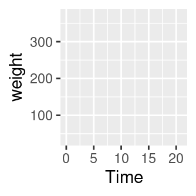

# Introduction to R


This tutorial aims to serve as an introduction to the software package R. Other very good and much more exhaustive tutorials and useful reference-cards can be found at the following links: 

*  [Reference card for R commands](http://cran.r-project.org/doc/contrib/refcard.pdf) (always useful)
*  [Matlab/R reference card](http://www.math.umaine.edu/~hiebeler/comp/matlabR.pdf) (for those who are more familiar with Matlab)
*  [The official Introduction to R](https://cran.r-project.org/doc/manuals/r-release/R-intro.pdf) (very detailed)
*  And many more at [www.r-project.org](https://www.r-project.org/other-docs.html) (see "Documents")
<!-- *  An interactive introduction can be done online at: [www.datacamp.com](https://www.datacamp.com/) -->
* An R-package for learning R: [www.swirl.com](https://swirlstats.com/)
*  An excellent book project which covers also advanced issues such as "writing performant code" and "package development": [adv-r.had.co.nz](http://adv-r.had.co.nz/)  
* Another excellent book: [R for Data Science](https://r4ds.had.co.nz/)

Some other tutorials:

*  [Introduction to data science](https://idc9.github.io/stor390/)
*  [Scraping the web using R](https://stat4701.github.io/edav/2015/04/02/rvest_tutorial/)
*  [Creating dynamic graphics](https://gganimate.com/)


Why R? 

*  R is **free** of charge from: [www.r-project.org](https://www.r-project.org/)
*  The celebrated IDE **RStudio** for R is also **free** of charge: [www.rstudio.com](http://www.rstudio.com/)
*  R is equipped with one of the most flexible and powerful graphics routines available anywhere. \
   For instance, check out one of the following repositories: 
    * [Clean Graphs](http://shinyapps.org/apps/RGraphCompendium/index.php) 
    * [R graph catalog](http://shiny.stat.ubc.ca/r-graph-catalog/)
    * [Publication Ready Plots](http://www.sthda.com/english/rpkgs/ggpubr/)
*  Today, R is the de-facto standard for statistical science.


## Short Glossary

Lets start the tutorial with a (very) short glossary:

* **Console**: The thing with the "**>**" sign at the beginning.
* **Script file**: An ordinary text file with suffix "**.R**". For instance, **yourFavoritFileName.R**.
* **Working directory**: The file-directory you are working in. Useful commands: with `getwd()` you get the location of your current working directory and `setwd()` allows you to set a new location for it. 
* **Workspace**: This is a hidden file (stored in the working directory), where all objects you use (e.g., data, matrices, vectors, variables, functions, etc.) are stored. Useful commands: `ls()` shows all elements in our current workspace and `rm(list=ls())` deletes all elements in our current workspace.


## First Steps


A good idea is to use a script file such as **yourFavoritFileName.R** in order to store your R commands. You can send single lines or marked regions of your R-code to the console by pressing the keys **STRG+ENTER**.


To begin with baby steps, do some simple computations: 

```r
2+2 # and all the others: *,/,-,^2,^3,... 
```

```
## [1] 4
```
Note: Everything that is written after the `#`-sign is ignored by R, which is very useful to comment your code.


The **assignment operator** will be your most often used tool. Here an example to create a **scalar** variable:

```r
x <- 4 
x
```

```
## [1] 4
```

```r
4 -> x # possible but unusual
x
```

```
## [1] 4
```
Note: The R community loves the `<-` assignment operator, which is a very unusual syntax. Alternatively, you can use the `=` operator.


And now a more interesting object - a **vector**:

```r
y <- c(2,7,4,1)
y
```

```
## [1] 2 7 4 1
```


 The command `ls()` shows the total content of your current workspace, and the command `rm(list=ls())` deletes all elements of your current workspace:

```r
ls()
```

```
## [1] "x" "y"
```

```r
rm(list=ls())
ls()
```

```
## character(0)
```
Note: RStudio's **Environment** pane also lists all the elements in your current workspace. That is, the command `ls()` becomes a bit obsolete when working with RStudio.


Let's try how we can compute with vectors and scalars in R. 

```r
x <- 4
y <- c(2,7,4,1)

x*y # each element in the vector, y, is multiplied by the scalar, x.
```

```
## [1]  8 28 16  4
```

```r
y*y # this is a term by term product of the elements in y
```

```
## [1]  4 49 16  1
```


Performing vector multiplications as you might expect from your last math-course, e.g., an outer product: $y\,y^\top$:

```r
y %*% t(y)
```

```
##      [,1] [,2] [,3] [,4]
## [1,]    4   14    8    2
## [2,]   14   49   28    7
## [3,]    8   28   16    4
## [4,]    2    7    4    1
```


Or an inner product $y^\top y$:

```r
t(y) %*% y
```

```
##      [,1]
## [1,]   70
```
Note: Sometimes, R's treatment of vectors can be annoying. The product `y %*% y` is treated as the product `t(y) %*% y`.


The term-by-term execution as in the above example, `y*y`, is actually a central strength of R. We can conduct many operations **vector-wisely**: 

```r
y^2
```

```
## [1]  4 49 16  1
```

```r
log(y)
```

```
## [1] 0.6931472 1.9459101 1.3862944 0.0000000
```

```r
exp(y)
```

```
## [1]    7.389056 1096.633158   54.598150    2.718282
```

```r
y-mean(y)
```

```
## [1] -1.5  3.5  0.5 -2.5
```

```r
(y-mean(y))/sd(y) # standardization 
```

```
## [1] -0.5669467  1.3228757  0.1889822 -0.9449112
```


This is a central characteristic of so called matrix based languages like R (or Matlab). Other programming languages often have to use **loops** instead:

```r
N <- length(y)
1:N

y.sq <- numeric(N)
y.sq

for(i in 1:N){
  y.sq[i] <- y[i]^2
  if(i == N){
    print(y.sq)
  }
}
```
The `for()`-loop is the most common loop. But there is also a `while()`-loop and a `repeat()`-loop. However, loops in R can be rather slow, therefore, try to avoid them!


<!-- Try to write your own loop, which computes the element-wise logarithms of a vector `y` and finally prints these values as well as their mean!  -->


Useful commands to produce **sequences** of numbers:

```r
1:10
-10:10
?seq # Help for the seq()-function
seq(from=1, to=100, by=7)
```


Using the sequence command `1:16`, we can go for our first **matrix**:

```r
?matrix
A <- matrix(data=1:16, nrow=4, ncol=4)
A
```

```
##      [,1] [,2] [,3] [,4]
## [1,]    1    5    9   13
## [2,]    2    6   10   14
## [3,]    3    7   11   15
## [4,]    4    8   12   16
```

```r
A <- matrix(1:16, 4, 4)
```


Note that a matrix has always two **dimensions**, but a vector has only one dimension:

```r
dim(A)    # Dimension of matrix A?
```

```
## [1] 4 4
```

```r
dim(y)    # dim() does not operate on vectors.
```

```
## NULL
```

```r
length(y) # Length of vector y?
```

```
## [1] 4
```


Lets play a bit with the matrix `A` and the vector `y`. As we have seen in the loop above, the `[]`-operator **selects elements** of vectors and matrices:

```r
A[,1]
A[4,4]
y[c(1,4)]
```


This can be done on a more **logical** basis, too. For example, if you want to know which elements in the first column of matrix `A` are strictly greater than 2:

```r
A[,1][A[,1]>2]
```

```
## [1] 3 4
```

```r
# Note that this give you a boolean vector:
A[,1]>2
```

```
## [1] FALSE FALSE  TRUE  TRUE
```

```r
# And you can use it in a non-sense relation, too:
y[A[,1]>2]
```

```
## [1] 4 1
```
Note: Logical operations return so-called **boolean** objects, i.e., either a `TRUE` or a `FALSE`. For instance, if we ask R whether `1>2` we get the answer `FALSE`.


## Further Data Objects

Besides classical data objects such as scalars, vectors, and matrices there are three further data objects in R:
\
\
1. The **array**: As a matrix but with more dimensions. Here is an example of a $2\times 2\times 2$-dimensional `array`:

```r
myFirst.Array <- array(c(1:8), dim=c(2,2,2)) # Take a look at it!
```
\
\
2. The **list**: In `lists` you can organize different kinds of data. E.g., consider the following example:

```r
myFirst.List <- list("Some_Numbers" = c(66, 76, 55, 12, 4, 66, 8, 99), 
                     "Animals"      = c("Rabbit", "Cat", "Elefant"),
                     "My_Series"    = c(30:1)) 
```


A very useful function to find specific values and entries within lists is the `str()`-function:

```r
str(myFirst.List)
```

```
## List of 3
##  $ Some_Numbers: num [1:8] 66 76 55 12 4 66 8 99
##  $ Animals     : chr [1:3] "Rabbit" "Cat" "Elefant"
##  $ My_Series   : int [1:30] 30 29 28 27 26 25 24 23 22 21 ...
```
\
\
3. The **data frame**: A `data.frame` is a `list`-object but with some more formal restrictions (e.g., equal number of rows for all columns). As indicated by its name, a `data.frame`-object is designed to store data:

```r
myFirst.Dataframe <- data.frame("Credit_Default"   = c( 0, 0, 1, 0, 1, 1), 
                                "Age"              = c(35,41,55,36,44,26), 
                                "Loan_in_1000_EUR" = c(55,65,23,12,98,76)) 
# Take a look at it!
```


\


## Simple Regression Analysis using R 

Alright, let's do some statistics with real data. You can download the data [HERE](https://github.com/lidom/Teaching_Repo). Save it on your computer, at a place where you can find it, and give the path (e.g. `"C:\textbackslash path\textbackslash auto.data.csv"`, which references to the data, to the *file*-argument of the function `read.csv()`:

```r
# ATTENTION! YOU HAVE TO CHANGE "\" TO "/":
auto.data <- read.csv(file="C:/your_path/autodata.txt", header=TRUE)
head(auto.data)
```

\


If you have problems to read the data into R, go on with these commands. (For this you need a working internet connection!):

```r
# install.packages("readr")
library("readr")
auto.data <- suppressMessages(read_csv(file = "https://cdn.rawgit.com/lidom/Teaching_Repo/bc692b56/autodata.csv",col_names = TRUE))
# head(auto.data)
```

\


You can select specific variables of the `auto.data` using the `$`-operator:

```r
gasolin.consumption      <- auto.data$MPG.city
car.weight               <- auto.data$Weight
## Take a look at the first elements of these vectors:
head(cbind(gasolin.consumption,car.weight))
```

```
##      gasolin.consumption car.weight
## [1,]                  25       2705
## [2,]                  18       3560
## [3,]                  20       3375
## [4,]                  19       3405
## [5,]                  22       3640
## [6,]                  22       2880
```

\


This is how you can produce your first plot:


```r
## Plot the data:
plot(y=gasolin.consumption, x=car.weight, 
     xlab="Car-Weight (US-Pounds)", 
     ylab="Consumption (Miles/Gallon)", 
     main="Buy Light-Weight Cars!")
```


\


As a first step, we might assume a simple kind of linear relationship between the variables `gasolin.consumption` and `car.weight`. Let us assume that the data was generated by the following simple regression model: 
$$
y_i=\alpha+\beta_1 x_i+\varepsilon_i,\quad i=1,\dots,n
$$
where $y_i$ denotes the gasoline-consumption, $x_i$ the weight of car $i$, and $\varepsilon_i$ is a mean zero constant variance noise term. (This is clearly a non-sense model!) 

The command `lm()` computes the estimates of this linear regression model. The command (in fact it's a *method*) `summary()` computes further quantities of general interest from the *object* that was returned from the `lm()` function.

```r
lm.result   <- lm(gasolin.consumption~car.weight)
lm.summary  <- summary(lm.result)
lm.summary
```

```
## 
## Call:
## lm(formula = gasolin.consumption ~ car.weight)
## 
## Residuals:
##     Min      1Q  Median      3Q     Max 
## -6.7946 -1.9711  0.0249  1.1855 13.8278 
## 
## Coefficients:
##              Estimate Std. Error t value Pr(>|t|)    
## (Intercept) 47.048353   1.679912   28.01   <2e-16 ***
## car.weight  -0.008032   0.000537  -14.96   <2e-16 ***
## ---
## Signif. codes:  0 '***' 0.001 '**' 0.01 '*' 0.05 '.' 0.1 ' ' 1
## 
## Residual standard error: 3.038 on 91 degrees of freedom
## Multiple R-squared:  0.7109,	Adjusted R-squared:  0.7077 
## F-statistic: 223.8 on 1 and 91 DF,  p-value: < 2.2e-16
```

\


Of course, we want to have a possibility to access all the quantities computed so far, e.g., in order to plot the results. This can be done as following: 

```r
## Accessing the computed quantities
names(lm.summary) ## Alternatively: str(lm.summary)
```

```
##  [1] "call"          "terms"         "residuals"     "coefficients" 
##  [5] "aliased"       "sigma"         "df"            "r.squared"    
##  [9] "adj.r.squared" "fstatistic"    "cov.unscaled"
```

```r
alpha <- lm.summary$coefficients[1]
beta  <- lm.summary$coefficients[2]

## Plot all:
plot(y=gasolin.consumption, x=car.weight, 
     xlab="Car-Weight (US-Pounds)", 
     ylab="Consumption (Miles/Gallon)", 
     main="Buy light-weight Cars!")
abline(a=alpha, 
       b=beta, col="red")
```


\


## Programming in R

Let's write, i.e., program our own R-function for estimating linear regression models. In order to be able to validate our function, we start with **simulating data** for which we then *know* all true parameters. Simulating data is like being the "Data-God": For instance, we generate realizations of the error term $\varepsilon_i$, i.e., something which we *never* observe in real data. 

\

Let us consider the following multiple regression model:

$$y_i=\beta_1 +\beta_2 x_{2i}+\beta_3 x_{3i}+\varepsilon_{i},\quad i=1,\dots,n,$$
where $\varepsilon_{i}$ is a heteroscedastic error term
$$\varepsilon_{i}\sim N(0,\sigma_i^2),\quad \sigma_i=x_{3i},$$

and where for all $i=1,\dots,n=50$:

* $x_{2i}\sim N(10,1.5^2)$
* $x_{3i}$ comes from a t-distribution with 5 degrees of freedom and non-centrality parameter 2


```r
set.seed(109) # Sets the "seed" of the random number generators:
n   <- 50     # Number of observations

## Generate two explanatory variables plus an intercept-variable:
X.1 <- rep(1, n)                 # Intercept
X.2 <- rnorm(n, mean=10, sd=1.5) # Draw realizations form a normal distr.
X.3 <- rt(n, df=5, ncp=2)        # Draw realizations form a t-distr.
X   <- cbind(X.1, X.2, X.3)      # Save as a Nx3-dimensional data matrix.
```


OK, we have regressors, i.e., data that we also have in real data sets. 

Now we define the elements of the $\beta$-vector. Be aware of the difference: In real data sets we do not know the true $\beta$-vector, but try to estimate it. However, when simulating data, we determine (as "Data-Gods") the true $\beta$-vector and can compare our estimate $\hat{\beta}$ with the true $\beta$:

```r
## Define the slope-coefficients
beta.vec  <- c(1,-5,5)
```


\
We still need to simulate realizations of the dependent variable $y_i$. Remember that $y_i=\beta_1 x_{1i}+\beta_1 x_{2i}+\beta_3 x_{3i}+\varepsilon_{i}$. That is, we only need realizations from the error terms $\varepsilon_i$ in order to compute the realizations from $y_i$. This is how you can simulate realizations from the heteroscedastic error terms $\varepsilon_i$:


```r
## Generate realizations from the heteroscadastic error term
eps       <- (X.3)*rnorm(n, mean=0, sd=1)
```

Take a look at the heteroscedasticity in the error term:


```r
plot(y=eps, x=X.3, 
     main="Realizations of the \nHeteroscedastic Error Term")
```


With the (pseudo-random) realizations from $\varepsilon_i$, we can finally generate realizations from the dependent variable $y_i$:

```r
## Dependent variable:
y   <- X %*% beta.vec + eps
```


Let's take a look at the data:

```r
mydata    <- data.frame("Y"=y, "X.1"=X.1, "X.2"=X.2, "X.3"=X.3)
pairs(mydata[,-2]) # The '-2' removes the intercept variable "X.1"
```


\


Once we have data, we can compute the OLS estimate of the true $\beta$ vector. Remember the formula:
$$\hat{\beta}=(X^\top X)^{-1}X^\top y$$
In R-Code this is: $(X^\top X)^{-1}=$`solve(t(X) %*% X)`, i.e.:

```r
## Computation of the beta-Vector:
beta.hat <- solve(t(X) %*% X) %*% t(X) %*% y
beta.hat
```

```
##          [,1]
## X.1 -2.735042
## X.2 -4.685719
## X.3  5.091811
```

\


Well done. Using the above lines of code we can easily program our own `myOLSFun()` function!

```r
myOLSFun <- function(y, x, add.intercept=FALSE){
  
  ## Number of Observations:
  n         <- length(y)
  
  ## Add an intercept to x:
  if(add.intercept){
    Intercept <- rep(1, n)
    x         <- cbind(Intercept, x)
  }
  
  ## Estimation of the slope-parameters:
  beta.hat.vec <- solve(t(x) %*% x) %*% t(x) %*% y
  
  ## Return the result:
  return(beta.hat.vec)
}

## Run the function:
myOLSFun(y=y, x=X)
```

```
##          [,1]
## X.1 -2.735042
## X.2 -4.685719
## X.3  5.091811
```


\


Can you extend the function for the computation of the covariance matrix of the slope-estimates, several measures of fits (R$^2$, adj.-R$^2$, etc.), t-tests, ...?


## R-packages


One of the best features in R are its contributed packages. The list of all packages on CRAN is impressive! Take a look at it [HERE](https://cran.r-project.org/web/packages/available_packages_by_name.html)


For instance, nice plots can be produced using the R-package is `ggplot2`. You can find an intro do this package [HERE](http://ggplot2.tidyverse.org/).

```r
# install.packages("ggplot2")
library("ggplot2")

qplot(Sepal.Length, Petal.Length, data = iris, color = Species)
```


\

Of course, `ggplot2` concerns "only" plotting, but you'll find R-packages for almost any statistical method out there.


## Tidyverse

The `tidyverse` package is a collection of packages that lets you import, 
manipulate, explore, visualize and model data in a harmonized and consistent way which 
helps you to be more productive. 


Installing the `tidyverse` package:

```r
install.packages("tidyverse")
```

To use the `tidyverse` package load it using the `library()` function:

```r
library(tidyverse)
```

```
## ── Attaching packages ─────────────────────────────────────── tidyverse 1.3.0 ──
```

```
## ✓ tibble  3.1.6     ✓ dplyr   1.0.4
## ✓ tidyr   1.1.2     ✓ stringr 1.4.0
## ✓ purrr   0.3.4     ✓ forcats 0.5.1
```

```
## ── Conflicts ────────────────────────────────────────── tidyverse_conflicts() ──
## x dplyr::filter() masks stats::filter()
## x dplyr::lag()    masks stats::lag()
```


**Chick Weight Data**

R comes with many datasets installed. We will use the `ChickWeight` dataset 
to learn about the tidyverse. The help system gives a basic summary of the experiment from 
which the data was collect:

> *"The body weights of the chicks were measured at birth and every second day thereafter 
until day 20. They were also measured on day 21. There were four groups of chicks on 
different protein diets."*

You can get more information, including references by typing:

```r
help("ChickWeight")
```


**The Data: ** 
There are 578 observations (rows) and 4 variables:

* `Chick` -- unique ID for each chick. 
* `Diet` -- one of four protein diets. 
* `Time` --  number of days since birth. 
* `weight` -- body weight of chick in grams.

Note: `weight` has a lower case `w` (recall R is case sensitive).


Store the data locally:

```r
ChickWeight %>%
  select(Chick, Diet, Time, weight) %>% 
  arrange(Chick, Diet, Time) %>% 
  write_csv("ChickWeight.csv")
```


First we will import the data from a file called `ChickWeight.csv` using the `read_csv()` 
function from the `readr` package (part of the `tidyverse`). The first thing to do, 
outside of R, is to open the file `ChickWeight.csv` to check what it contains and that 
it makes sense. Now we can import the data as follows:

```r
CW <- read_csv("ChickWeight.csv")
```

```
## 
## ── Column specification ────────────────────────────────────────────────────────
## cols(
##   Chick = col_double(),
##   Diet = col_double(),
##   Time = col_double(),
##   weight = col_double()
## )
```


If all goes well then the data is now stored in an R object called `CW`. If you get the
following error message then you need to change the working directory to where the data is
stored.
```
Error: 'ChickWeight.csv' does not exist in current
working directory ...
```
**Changing the working directory:** 
In RStudio you can use the menu bar ("Session - Set Working Directory - Choose Directory..."). Alternatively, you can use the function `setwd()`.


\


**Looking at the Dataset:**
To look at the data type just type the object (dataset) name: 

```r
CW
```

```
## # A tibble: 578 × 4
##    Chick  Diet  Time weight
##    <dbl> <dbl> <dbl>  <dbl>
##  1    18     1     0     39
##  2    18     1     2     35
##  3    16     1     0     41
##  4    16     1     2     45
##  5    16     1     4     49
##  6    16     1     6     51
##  7    16     1     8     57
##  8    16     1    10     51
##  9    16     1    12     54
## 10    15     1     0     41
## # … with 568 more rows
```


If there are too many variables then not all them may be printed. To overcome this issue
we can use the `glimpse()` function which makes it possible to see every column in your
dataset (called a "data frame" in R speak).

```r
glimpse(CW)
```

```
## Rows: 578
## Columns: 4
## $ Chick  <dbl> 18, 18, 16, 16, 16, 16, 16, 16, 16, 15, 15, 15, 15, 15, 15, 15,…
## $ Diet   <dbl> 1, 1, 1, 1, 1, 1, 1, 1, 1, 1, 1, 1, 1, 1, 1, 1, 1, 1, 1, 1, 1, …
## $ Time   <dbl> 0, 2, 0, 2, 4, 6, 8, 10, 12, 0, 2, 4, 6, 8, 10, 12, 14, 0, 2, 4…
## $ weight <dbl> 39, 35, 41, 45, 49, 51, 57, 51, 54, 41, 49, 56, 64, 68, 68, 67,…
```

The function `View()` allows for a spread-sheet type of view on the data:

```r
View(CW)
```


### Tidyverse: Plotting Basics


To **visualise** the chick weight data, we will use the `ggplot2` package (part of the
`tidyverse`). Our interest is in seeing how the *weight changes over time for the chicks by
diet*. For the moment don't worry too much about the details just try to build your own 
understanding and logic. To learn more try different things even if you get an error
messages.


Let's plot the weight data (vertical axis) over time (horizontal axis).

```r
# An empty plot (the plot on the left)
ggplot(CW, aes(Time, weight))  
# With data (the plot on the right)
ggplot(CW, aes(Time, weight)) + geom_point() 
```




Add color for `Diet`. The graph above does not differentiate between the diets. Let's use a different color for
each diet.

```r
# Adding colour for diet
ggplot(CW,aes(Time,weight,colour=factor(Diet))) +
  geom_point() 
```


It is difficult to conclude anything from this graph as the points are printed on top of
one another (with diet 1 underneath and diet 4 at the top). 


**Factor Variables:**
Before we continue, we have to make an important change to the `CW` dataset by making
`Diet` and `Time` *factor variables*. This means that R will treat them as categorical 
variables (see the `<fct>` variables below) instead of continuous variables. It will 
simplify our coding. The next section will explain the  `mutate()` function.

```r
CW <- mutate(CW, Diet = factor(Diet))
CW <- mutate(CW, Time = factor(Time))
glimpse(CW)
```

```
## Rows: 578
## Columns: 4
## $ Chick  <dbl> 18, 18, 16, 16, 16, 16, 16, 16, 16, 15, 15, 15, 15, 15, 15, 15,…
## $ Diet   <fct> 1, 1, 1, 1, 1, 1, 1, 1, 1, 1, 1, 1, 1, 1, 1, 1, 1, 1, 1, 1, 1, …
## $ Time   <fct> 0, 2, 0, 2, 4, 6, 8, 10, 12, 0, 2, 4, 6, 8, 10, 12, 14, 0, 2, 4…
## $ weight <dbl> 39, 35, 41, 45, 49, 51, 57, 51, 54, 41, 49, 56, 64, 68, 68, 67,…
```


The `facet_wrap()` function: To plot each diet separately in a grid using `facet_wrap()`:

```r
# Adding jitter to the points
ggplot(CW, aes(Time, weight, colour=Diet)) +
  geom_point() +
  facet_wrap(~Diet) +
  theme(legend.position = "bottom")
```


<!-- To overcome the issue of ovelapping points we can ***jitter*** the points using  -->
<!-- `geom_jitter()`. Replace the `geom_point()` above with `geom_jitter()`. What do you -->
<!-- observe? -->


<!-- ```{r jitterPlot2} -->
<!-- # Adding jitter to the points -->
<!-- ggplot(CW, aes(Time, weight, colour=Diet)) + -->
<!--   geom_jitter() + -->
<!--   facet_wrap(~Diet) + -->
<!--   theme(legend.position = "bottom") -->
<!-- ``` -->


**Interpretation:** Diet 4 has the least variability but we can't really say anything about the mean effect
of each diet although diet 3 seems to have the highest.


Next we will plot the **mean changes** over time for each diet using the `stat_summary()` function:

```r
ggplot(CW, aes(Time, weight, 
               group=Diet, colour=Diet)) +
  stat_summary(fun.y="mean", geom="line") 
```

```
## Warning: `fun.y` is deprecated. Use `fun` instead.
```


**Interpretation:**
We can see that diet 3 has the highest mean weight gains by the end of the experiment. However, 
we don't have any information about the variation (uncertainty) in the data.


To see variation between the different diets we use `geom_boxplot` to plot a box-whisker plot. 
A note of caution is that the number of chicks per diet is relatively low to produce this plot.

```r
ggplot(CW, aes(Time, weight, colour=Diet)) +
  facet_wrap(~Diet) +
  geom_boxplot() +
  theme(legend.position = "none") +
  ggtitle("Chick Weight over Time by Diet")
```


**Interpretation:**
Diet 3 seems to have the highest "average" weight gain but it has more variation 
than diet 4 which is consistent with our findings so far. 


Let's finish with a plot that you might include in a publication.

```r
ggplot(CW, aes(Time, weight, group=Diet, 
                             colour=Diet)) +
  facet_wrap(~Diet) +
  geom_point() +
  # geom_jitter() +
  stat_summary(fun.y="mean", geom="line",
               colour="black") +
  theme(legend.position = "none") +
  ggtitle("Chick Weight over Time by Diet") + 
  xlab("Time (days)") +
  ylab("Weight (grams)")
```

```
## Warning: `fun.y` is deprecated. Use `fun` instead.
```


### Tidyverse: Data Wrangling Basics


In this section we will learn how to wrangle (manipulate) datasets using the `tidyverse`
package. Let's start with the `mutate()`, `select()`, `rename()`, `filter()` and `arrange()` 
functions.

\

`mutate()`: Adds a new variable (column) or modifies an existing one. We already used this above to create
factor variables.

```r
# Added a column
CWm1 <- mutate(CW, weightKg = weight/1000)
CWm1
```

```
## # A tibble: 578 × 5
##   Chick Diet  Time  weight weightKg
##   <dbl> <fct> <fct>  <dbl>    <dbl>
## 1    18 1     0         39    0.039
## 2    18 1     2         35    0.035
## 3    16 1     0         41    0.041
## # … with 575 more rows
```

```r
# Modify an existing column
CWm2 <- mutate(CW, Diet = str_c("Diet ", Diet))
CWm2
```

```
## # A tibble: 578 × 4
##   Chick Diet   Time  weight
##   <dbl> <chr>  <fct>  <dbl>
## 1    18 Diet 1 0         39
## 2    18 Diet 1 2         35
## 3    16 Diet 1 0         41
## # … with 575 more rows
```

\

`select()`: Keeps, drops or reorders variables.

```r
# Drop the weight variable from CWm1 using minus
select(CWm1, -weight)
```

```
## # A tibble: 578 × 4
##   Chick Diet  Time  weightKg
##   <dbl> <fct> <fct>    <dbl>
## 1    18 1     0        0.039
## 2    18 1     2        0.035
## 3    16 1     0        0.041
## # … with 575 more rows
```

```r
# Keep variables Time, Diet and weightKg
select(CWm1, Chick, Time, Diet, weightKg)
```

```
## # A tibble: 578 × 4
##   Chick Time  Diet  weightKg
##   <dbl> <fct> <fct>    <dbl>
## 1    18 0     1        0.039
## 2    18 2     1        0.035
## 3    16 0     1        0.041
## # … with 575 more rows
```

\

`rename()`: Renames variables whilst keeping all variables.

```r
rename(CW, Group = Diet, Weight = weight)
```

```
## # A tibble: 578 × 4
##   Chick Group Time  Weight
##   <dbl> <fct> <fct>  <dbl>
## 1    18 1     0         39
## 2    18 1     2         35
## 3    16 1     0         41
## # … with 575 more rows
```

\

`filter()`: Keeps or drops observations (rows).

```r
filter(CW, Time==21 & weight>300)
```

```
## # A tibble: 8 × 4
##   Chick Diet  Time  weight
##   <dbl> <fct> <fct>  <dbl>
## 1     7 1     21       305
## 2    29 2     21       309
## 3    21 2     21       331
## # … with 5 more rows
```

For comparing values in vectors use: `<` (less than), `>` (greater than), `<=`
(less than and equal to), `>=` (greater than and equal to), `==` (equal to) and `!=`
(not equal to). These can be combined logically using `&` (and) and `|` (or).

\

`arrange()`: Changes the order of the observations.

```r
arrange(CW, Chick, Time)
```

```
## # A tibble: 578 × 4
##   Chick Diet  Time  weight
##   <dbl> <fct> <fct>  <dbl>
## 1     1 1     0         42
## 2     1 1     2         51
## 3     1 1     4         59
## # … with 575 more rows
```

```r
arrange(CW, desc(weight))
```

```
## # A tibble: 578 × 4
##   Chick Diet  Time  weight
##   <dbl> <fct> <fct>  <dbl>
## 1    35 3     21       373
## 2    35 3     20       361
## 3    34 3     21       341
## # … with 575 more rows
```


What does the `desc()` do? Try using `desc(Time)`.


###  The pipe operator `%>%`


In reality you will end up doing multiple data wrangling steps that you want to save.
The pipe operator `%>%` makes your code nice and readable:

```r
CW21 <- CW %>% 
  filter(Time %in% c(0, 21)) %>% 
  rename(Weight = weight) %>% 
  mutate(Group = factor(str_c("Diet ", Diet))) %>% 
  select(Chick, Group, Time, Weight) %>% 
  arrange(Chick, Time) 
CW21
```

```
## # A tibble: 95 × 4
##   Chick Group  Time  Weight
##   <dbl> <fct>  <fct>  <dbl>
## 1     1 Diet 1 0         42
## 2     1 Diet 1 21       205
## 3     2 Diet 1 0         40
## # … with 92 more rows
```


Hint: To understand the code above we should read the pipe operator ` %>%` as "then".

> Create a new dataset (object) called `CW21` using dataset `CW` ***then***
keep the data for days 0 and 21 ***then*** rename variable `weight` to `Weight`
***then*** create a variable called `Group` ***then*** keep variables `Chick`, 
`Group`, `Time` and `Weight` and ***then*** finally arrange the data by 
variables `Chick` and `Time`.


This is the same code:

```r
CW21 <- CW %>% 
  filter(., Time %in% c(0, 21)) %>% 
  rename(., Weight = weight) %>% 
  mutate(., Group=factor(str_c("Diet ",Diet))) %>% 
  select(., Chick, Group, Time, Weight) %>% 
  arrange(., Chick, Time) 
```

The pipe operator, `%>%`, replaces the dots (`.`) with whatever is returned from code
preceding it. For example, the dot in `filter(., Time %in% c(0, 21))` is replaced by
`CW`. The output of the `filter(...)` then replaces the dot in 
`rename(., Weight = weight)` and so on. Think of it as a data assembly line with 
each function doing its thing and passing it to the next.


### The `group_by()` function


From the data visualizations above we concluded that the diet 3 has the highest mean 
and diet 4 the least variation. In this section, we will quantify the effects of the 
diets using **summmary statistics**. We start by looking at the number of observations 
and the mean by **diet** and **time**.

```r
mnsdCW <- CW %>% 
  group_by(Diet, Time) %>% 
  summarise(N = n(), Mean = mean(weight)) %>% 
  arrange(Diet, Time)
```

```
## `summarise()` has grouped output by 'Diet'. You can override using the `.groups` argument.
```

```r
mnsdCW
```

```
## # A tibble: 48 × 4
## # Groups:   Diet [4]
##   Diet  Time      N  Mean
##   <fct> <fct> <int> <dbl>
## 1 1     0        20  41.4
## 2 1     2        20  47.2
## 3 1     4        19  56.5
## # … with 45 more rows
```

 
For each distinct combination of `Diet` and `Time`, the chick weight data is summarized 
into the number of observations (`N`) and the mean (`Mean`) of `weight`.


**Further summaries:** Let's also calculate the standard deviation, median, minimum and maximum values but only
at days 0 and 21.

```r
sumCW <-  CW %>% 
  filter(Time %in% c(0, 21)) %>% 
  group_by(Diet, Time) %>% 
  summarise(N = n(),
            Mean = mean(weight),
            SD = sd(weight),
            Median = median(weight),
            Min = min(weight),
            Max = max(weight)) %>% 
  arrange(Diet, Time)
```

```
## `summarise()` has grouped output by 'Diet'. You can override using the `.groups` argument.
```

```r
sumCW
```

```
## # A tibble: 8 × 8
## # Groups:   Diet [4]
##   Diet  Time      N  Mean     SD Median   Min   Max
##   <fct> <fct> <int> <dbl>  <dbl>  <dbl> <dbl> <dbl>
## 1 1     0        20  41.4  0.995   41      39    43
## 2 1     21       16 178.  58.7    166      96   305
## 3 2     0        10  40.7  1.49    40.5    39    43
## # … with 5 more rows
```

Let's make the summaries "prettier", say, for a report or publication.

```r
library("knitr") # to use the kable() function
prettySumCW <- sumCW %>% 
 mutate(`Mean (SD)` = str_c(format(Mean, digits=1),
           " (", format(SD, digits=2), ")")) %>% 
 mutate(Range = str_c(Min, " - ", Max)) %>% 
 select(Diet, Time, N, `Mean (SD)`, Median, Range) %>%
 arrange(Diet, Time) %>% 
 kable(format = "latex")
prettySumCW
```

<table>
 <thead>
  <tr>
   <th style="text-align:left;"> Diet </th>
   <th style="text-align:left;"> Time </th>
   <th style="text-align:right;"> N </th>
   <th style="text-align:left;"> Mean (SD) </th>
   <th style="text-align:right;"> Median </th>
   <th style="text-align:left;"> Range </th>
  </tr>
 </thead>
<tbody>
  <tr>
   <td style="text-align:left;"> 1 </td>
   <td style="text-align:left;"> 0 </td>
   <td style="text-align:right;"> 20 </td>
   <td style="text-align:left;"> 41 ( 0.99) </td>
   <td style="text-align:right;"> 41.0 </td>
   <td style="text-align:left;"> 39 - 43 </td>
  </tr>
  <tr>
   <td style="text-align:left;"> 1 </td>
   <td style="text-align:left;"> 21 </td>
   <td style="text-align:right;"> 16 </td>
   <td style="text-align:left;"> 178 (58.70) </td>
   <td style="text-align:right;"> 166.0 </td>
   <td style="text-align:left;"> 96 - 305 </td>
  </tr>
  <tr>
   <td style="text-align:left;"> 2 </td>
   <td style="text-align:left;"> 0 </td>
   <td style="text-align:right;"> 10 </td>
   <td style="text-align:left;"> 41 ( 1.5) </td>
   <td style="text-align:right;"> 40.5 </td>
   <td style="text-align:left;"> 39 - 43 </td>
  </tr>
  <tr>
   <td style="text-align:left;"> 2 </td>
   <td style="text-align:left;"> 21 </td>
   <td style="text-align:right;"> 10 </td>
   <td style="text-align:left;"> 215 (78.1) </td>
   <td style="text-align:right;"> 212.5 </td>
   <td style="text-align:left;"> 74 - 331 </td>
  </tr>
  <tr>
   <td style="text-align:left;"> 3 </td>
   <td style="text-align:left;"> 0 </td>
   <td style="text-align:right;"> 10 </td>
   <td style="text-align:left;"> 41 ( 1) </td>
   <td style="text-align:right;"> 41.0 </td>
   <td style="text-align:left;"> 39 - 42 </td>
  </tr>
  <tr>
   <td style="text-align:left;"> 3 </td>
   <td style="text-align:left;"> 21 </td>
   <td style="text-align:right;"> 10 </td>
   <td style="text-align:left;"> 270 (72) </td>
   <td style="text-align:right;"> 281.0 </td>
   <td style="text-align:left;"> 147 - 373 </td>
  </tr>
  <tr>
   <td style="text-align:left;"> 4 </td>
   <td style="text-align:left;"> 0 </td>
   <td style="text-align:right;"> 10 </td>
   <td style="text-align:left;"> 41 ( 1.1) </td>
   <td style="text-align:right;"> 41.0 </td>
   <td style="text-align:left;"> 39 - 42 </td>
  </tr>
  <tr>
   <td style="text-align:left;"> 4 </td>
   <td style="text-align:left;"> 21 </td>
   <td style="text-align:right;"> 9 </td>
   <td style="text-align:left;"> 239 (43.3) </td>
   <td style="text-align:right;"> 237.0 </td>
   <td style="text-align:left;"> 196 - 322 </td>
  </tr>
</tbody>
</table>


<!-- Eventually you should be able to produce a publication ready version as follows: -->
<!-- ```{r prettyKable, echo = FALSE} -->
<!-- library("knitr") -->
<!-- prettySumCW %>%  -->
<!-- kable("latex", booktabs = TRUE, linesep = "", align = "cccrc") %>%  -->
<!--   #kable_styling(position = "center") %>%  -->
<!--   row_spec(0, bold = TRUE) %>% -->
<!--   row_spec(c(2, 4, 6, 8), background = "lightgray") -->
<!--   # Uncomment below once bugs are fixed - https://github.com/haozhu233/kableExtra/issues/243 & 237 -->
<!--   # column_spec(1, bold = T) %>% -->
<!--   # collapse_rows(columns = 1, latex_hline = "none", valign = "top") -->
<!-- ``` -->


**Interpretation:**
This summary table offers the same interpretation as before, namely that diet 3 has the 
highest mean and median weights at day 21 but a higher variation than group 4.
However it should be noted that at day 21, diet 1 lost 4 chicks from 20 that started 
and diet 4 lost 1 from 10. This could be a sign of some health related issues.


## Further Links


### Further R-Intros

* https://eddelbuettel.github.io/gsir-te/Getting-Started-in-R.pdf

* https://www.datacamp.com/courses/free-introduction-to-r

* https://swcarpentry.github.io/r-novice-gapminder/

* https://support.rstudio.com/hc/en-us/articles/200526207-Using-Projects


### Version Control (Git/GitHub)

* https://support.rstudio.com/hc/en-us/articles/200532077-Version-Control-with-Git-and-SVN

* http://happygitwithr.com/

* https://www.gitkraken.com/


### R-Ladies 

* https://rladies.org/


